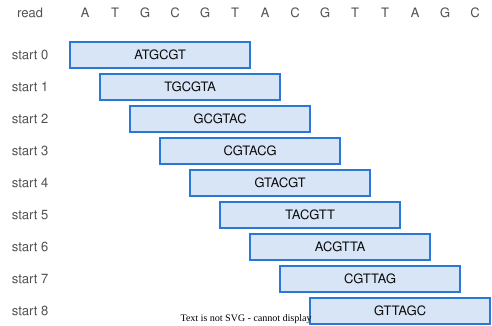

# Naive Bayes: classification as a generative story {#sec-naive-bayes}
::: {.callout-warning title="Under construction"}
<!-- banner:under-construction -->
This chapter is drafted but **not yet instructor-reviewed**. Content may change without
notice until unit 5 opens. Read ahead at your own risk.
:::


## The problem

The question this chapter answers comes from a sequencing run that was
supposed to be free of one kind of RNA and is not.

### Reads to delete, and two ways to get it wrong {#sec-naive-bayes-two-mistakes}

A collaborator has sequenced the RNA -- the so-called **transcriptome** --
in a tissue sample. The library preparation kit used for the sample claims to
remove **ribosomal RNA** before sequencing. Ribosomal RNA, or **rRNA**, is the
set of genes whose RNA transcripts assemble to form the ribosome complex, and
most of the RNA mass of a cell is made up of rRNA. In a library that does not
remove it, most of the reads generated by a transcriptome sequencing run are
rRNA reads, leaving few reads left for the rest of the gene transcripts that
are typically the ones of interest when studying the whole transcriptome. No
library preparation kit removes all of the rRNA molecules from a sample, but
effective kits will remove most of them.

The sequencer run returned 100,000 reads. Some unknown share of them are rRNA
reads that survived the removal step, and the collaborator wants those reads
identified and set aside before any downstream analysis counts them as signal.

Two mistakes are possible, and their consequences differ. Deleting a read that
was not rRNA removes real signal from the experiment. Keeping a read that was
rRNA leaves noise in every count made afterwards. So the collaborator needs
two things for every read: a call, rRNA or not, and a probability that says how
much to trust the call.

Both come from the read's sequence, so the first question is what in a
sequence counts as evidence.

### A read, cut into k-mers {#sec-naive-bayes-kmers}

The evidence for each call is the read's sequence, summarized in a particular
way. A read is a sequence of bases that represent the nucleotides that were
in the original molecule. A **k-mer** is a window of k bases taken
from a sequence, and the k in the name is the length of the window. Sliding
the window along a read one base at a time lists every k-mer the read
contains. The chunk below takes one short read and cuts it into its 6-mers.

```{python}
read = "ATGCGTACGTTAGC"          # a 14-base read
print("bases in the read:", len(read))
# slide a window of six bases along the read, one start position at a time
for start in range(len(read) - 5):
    print(start, read[start:start + 6])
# how many different 6-mers exist at all: four choices at each of six positions
print("different 6-mers that exist:", 4 ** 6)
```

::: {.callout-important title="New Coding Concept: len"}
`len(read)` returns the number of items in a sequence, here the number of
bases in the string `read`. Read the line `for start in range(len(read) - 5)`
aloud as *for every start position from 0 up to the length of the read minus
five*. A 6-mer needs six bases, so the last window starts five bases before the
end. Because the loop asks the read for its own length, the same loop cuts a
read of any length.
:::

{fig-alt="A fourteen-base read, A T G C G T A C G T T A G C, written one base per cell across the top, labeled read. Below it, nine rows labeled start 0 to start 8. Each row holds one box six cells wide containing that window's six bases, and each box begins one cell further right than the box above it, so the nine boxes step down the read like a staircase."}

Fourteen bases give nine windows, and neighboring windows share five of their
six bases. Real reads run to hundreds of bases and hundreds of windows. The
set of all possible 6-mers is the **vocabulary**, and there are 4,096 of them.
rRNA has its own sequence composition, so some k-mers in the vocabulary occur
in rRNA reads far more often than in non-rRNA reads, and some occur far less
often.

A read has hundreds of windows, and the collaborator's tool does not report
them all. It reports a fixed few, and it reports each one as a yes or a no.

### Twenty yes-or-no answers per read {#sec-naive-bayes-profile}

Every read in the collaborator's data belongs to one of two **classes**. An
**rRNA read** came from a ribosomal RNA molecule, and a **non-rRNA read** came
from anything else in the sample. These two names are used for the two
classes throughout the chapter. A previous analysis of RNA sequencing data
identified a fixed **panel** of twenty k-mers from the vocabulary. Each k-mer
in the panel was chosen because it is consistently more common in one class
than in the other, some in rRNA reads and some in non-rRNA reads. For each
read, the tool checks whether each panel k-mer appears anywhere among the
read's windows. One read therefore becomes twenty yes-or-no answers, and we
call those twenty answers the read's **profile**. The collaborator also has
**training data**: reads whose class is known, each labeled rRNA or non-rRNA.
The labels exist because each training read was **aligned to a reference**,
matched base for base against a known rRNA sequence, and either matched or
did not.

```{python}
#| echo: false
#| fig-cap: "One read's profile, as the tool reports it: twenty k-mers from the panel, each present or absent."
import matplotlib.pyplot as plt

# a profile chosen by hand, to show the shape of the data: 1 present, 0 absent
profile = [0, 1, 1, 0, 1, 0, 0, 1, 1, 1, 0, 1, 0, 0, 1, 1, 0, 1, 0, 1]

fig, ax = plt.subplots(figsize=(7, 1.3))
for i in range(20):
    if profile[i] == 1:
        face = "#2a78d6"
    else:
        face = "#ffffff"
    ax.add_patch(plt.Rectangle((i, 0), 1, 1, facecolor=face, edgecolor="#52514e", lw=1.2))
    ax.text(i + 0.5, -0.35, str(i), ha="center", va="top", fontsize=9, color="#52514e")
ax.text(-0.3, 0.5, "present", ha="right", va="center", color="#2a78d6")
ax.text(-0.3, -0.35, "k-mer", ha="right", va="top", fontsize=9, color="#52514e")
ax.set_xlim(-3, 20.2)
ax.set_ylim(-0.9, 1.1)
ax.axis("off")
plt.show()
```

The profile above was typed in by hand. The collaborator's question is the
question of @sec-mix, asked once per read. **For each of the 100,000 reads,
which process produced it, rRNA or non-rRNA, and is the answer confident enough
to delete the read?** In @sec-mix we classified one read from one measurement,
its GC count. In this chapter we use the same two-step model with twenty
measurements per read instead of one.

Two things change when the measurements multiply. The counting method of
@sec-mix stops working, and the calculation that replaces it assumes that
the twenty measurements are independent, an assumption real reads violate.
Both begin with the model of how a read is made.

## The story

A read is generated in two steps, as in @sec-mix, and the second step
carries an assumption this chapter adopts knowing it is false.

### Two steps: a class, then twenty draws {#sec-naive-bayes-two-steps}

Our model for one read has two steps, as in @sec-mix, and the picture shows
them.

{fig-alt="A flow diagram. A diamond on the left reads pick rRNA with probability pi. Two arrows leave it. The upper arrow, labeled Chose rRNA, goes to a box reading draw each of the twenty k-mers' presence from the rRNA table. The lower arrow, labeled Chose non-rRNA, goes to a box reading draw each of the twenty k-mers' presence from the non-rRNA table."}

1. **The class is drawn.** With probability $\pi$ the read is rRNA, and
   otherwise it is not. Step 1 is the class-selection step of @sec-mix. There
   the two classes were Microbe A and Microbe B; here they are rRNA and
   non-rRNA.
2. **The k-mers are drawn given the class.** Each of the twenty panel k-mers is
   present in the read with a probability that depends on the class. For
   panel k-mer $i$, the probability of presence is $p_i$ if the read is rRNA
   and $q_i$ if it is non-rRNA. The twenty probabilities for one class are that
   class's **table**. Each presence is one yes-or-no draw, the single-trial
   draw we first made in @sec-simulating-a-process, and the twenty draws are
   made independently of one another.

Two draws are **independent** when learning the answer to one does not
change the probability of the other. Here, given the class, knowing that
k-mer 3 is present leaves the probability that k-mer 4 is present at $p_4$,
exactly what it was before. *Playing with the story* shows what that
definition looks like in counts.

The definition is exact for the model. Whether the reads the collaborator
sequenced obey it is a different question.

### An assumption adopted knowing it is false {#sec-naive-bayes-false-assumption}

For real reads the assumption is false. Neighboring k-mers overlap on the
read, as the sliding window showed, so a read that contains one k-mer is more
likely to contain the k-mers that overlap it, and their presences are
correlated. Our model ignores that correlation. We adopt the assumption
deliberately, because it makes the calculation in the next two sections
possible, and *When the model is wrong* measures the error it introduces.

The model is called **naive Bayes**. It is *Bayes* because classifying a read
is the posterior calculation of @sec-mix, and *naive* because the k-mers are
assumed independent given the class.

One more choice in the story deserves a word: why each k-mer is a yes-or-no
answer at all, when a read contains each k-mer some number of times.

### From k-mer counts to presence {#sec-naive-bayes-counts-to-presence}

Where does the presence model come from? A whole read's k-mers are counts:
for each k-mer of the vocabulary, how many of the read's windows are that
k-mer. A draw that lands in one of many categories rather than one of two is
called a **multinomial**, the many-outcome form of the binomial from
@sec-simulating-a-process. One read's counts across the 4,096 k-mers of the
vocabulary are one multinomial draw. This chapter keeps one yes-or-no answer
from that picture for each panel k-mer: whether its count is zero or not.
Every answer is then the single-trial draw of @sec-simulating-a-process, and
how many times a k-mer occurred in the read is discarded.

One more assumption carries over from @sec-mix. In the simulation, we know
which class produced each read, because we wrote the simulator. The training
data has labels because each training read was aligned to a reference. In
@sec-clustering we will meet the same model with the labels removed, and
there the per-read posterior this chapter computes becomes each read's soft
assignment to a class. In this chapter the labels are known.

That is the whole story: a class, twenty independent draws from that class's
table, and a label we can check. Written as a function, it draws a read in a
dozen lines.

## The story, as code

The story becomes a simulator in three pieces. The first is the settings, the
second a function that draws one read, and the third a loop that draws a
hundred thousand.

### One read, drawn by a function {#sec-naive-bayes-draw-one-read}

Our model's settings are three things: the share $\pi$ of reads that are rRNA,
the rRNA table of twenty presence probabilities, and the non-rRNA table. We
store the two tables in a **dictionary**, a Python container that looks up a
value by a name instead of by a position. For the simulation, the forty
probabilities are drawn once with `rng.uniform`, the call from @sec-repeat,
between 0.15 and 0.85, so that no k-mer is nearly always present or nearly
always absent in either class. Those forty numbers play the role that the
typed 0.66 and 0.48 played in @sec-mix. They are fixed for the rest of the
chapter, and they are drawn rather than typed only because there are forty
of them.

```{python}
import numpy as np

rng = np.random.default_rng(61)
# the model's settings: one presence probability per k-mer, for each class
presence_prob = {"rRNA":     rng.uniform(0.15, 0.85, size=20),
                 "non-rRNA": rng.uniform(0.15, 0.85, size=20)}

def draw_labeled_read(share_rrna, presence_prob, rng):
    """One read from the model: its class, then which of the 20 k-mers it contains."""
    # step 1: draw the class
    if rng.random() < share_rrna:
        label = "rRNA"
    else:
        label = "non-rRNA"
    # step 2: draw each k-mer's presence, using the class's own probabilities
    # (20 draws at once; True where the k-mer is present)
    present = rng.random(20) < presence_prob[label]
    # return the class and the twenty yes-or-no answers
    return label, present
```

The function first draws the class, rRNA with probability `share_rrna` and
non-rRNA otherwise. It then looks up that class's table and draws twenty random
numbers at once. The line `rng.random(20) < presence_prob[label]` compares
each random number to its own probability and returns twenty True or False
answers, True where the random number fell below the probability. The
comparison is the mask of @sec-mix, which compared every element at once,
applied here to twenty draws instead of to one hundred thousand reads. In
@sec-mix one random number was compared to one share; this line does that
twenty times in one comparison. The two steps of the model are the `if` block
and the line that fills `present`.

::: {.callout-important title="New Coding Concept: dictionary lookup"}
`presence_prob["rRNA"]` is a **dictionary lookup**. A dictionary stores values
under names, called keys, and `presence_prob["rRNA"]` returns the array stored
under the key `"rRNA"`. Read the line `presence_prob[label]` aloud as *the
presence probabilities stored under this read's label*. A list is looked up by
position, `draws[3]`, and a dictionary by name.
:::

One read is the story told once. The collaborator's training data is a
hundred thousand of them, each with a label we set.

### A hundred thousand labeled reads {#sec-naive-bayes-labeled-reads}

We now draw 100,000 reads from the model with 15% rRNA, the share left behind
by an imperfect removal step, and keep each read's label beside its twenty
answers. These simulated reads stand in for the collaborator's training data,
as the simulated reads of @sec-mix stood in for the mock community. The
collaborator's own 100,000 reads are a different set, and *What do we tell
our collaborator?* returns to them.

```{python}
rng = np.random.default_rng(67)
label_list, reads = [], []
for _ in range(100000):
    # draw one read: its class and its twenty k-mer answers
    label, present = draw_labeled_read(0.15, presence_prob, rng)
    # record the label and the answers
    label_list.append(label)
    reads.append(present)
labels = np.array(label_list)
print("share of reads that are rRNA:    ", (labels == "rRNA").mean())
print("share of reads that are non-rRNA:", (labels == "non-rRNA").mean())
print("first read:", labels[0], reads[0].astype(int))
```

The share of rRNA reads among the simulated reads is 0.1497, within a
thousandth of the 0.15 we set. The first read is printed with its label and
its twenty answers. The print converts True to 1 and False to 0 with
`.astype(int)`, so the profile from *The problem* appears here in digits.
Every label among the simulated reads is true by construction.

Before any read is classified, it is worth seeing how often each k-mer turns
up in each class, which is what the two tables produced.

### What the twenty k-mers look like, by class {#sec-naive-bayes-kmers-by-class}

The figure below shows how often each k-mer is present among the rRNA reads and among
the non-rRNA reads.

```{python}
#| echo: false
#| fig-cap: "How often each of the twenty k-mers is present, among the simulated rRNA reads and among the non-rRNA reads. The two classes differ at most k-mers, and no single k-mer separates them."
read_matrix = np.array(reads)
is_rrna = (labels == "rRNA")
fraction_rrna = read_matrix[is_rrna].mean(axis=0)
fraction_nonrrna = read_matrix[~is_rrna].mean(axis=0)

fig, ax = plt.subplots(figsize=(7, 3))
kmer = np.arange(20)
ax.bar(kmer - 0.2, fraction_rrna, width=0.4, color="#eb6834", label="rRNA reads")
ax.bar(kmer + 0.2, fraction_nonrrna, width=0.4, color="#2a78d6", label="non-rRNA reads")
ax.set_xlabel("k-mer")
ax.set_ylabel("fraction of reads\nwith the k-mer present")
ax.set_xticks(kmer)
ax.set_ylim(0, 1)
ax.legend(frameon=False)
ax.spines[["top", "right"]].set_visible(False)
plt.show()
```

At most k-mers the two bars differ, so most k-mers carry some information
about the class. At no k-mer is one bar near 1 and the other near 0, so no
single k-mer settles a read's class on its own. The twenty answers have to be
read together.

The method of @sec-mix read one measurement by counting the simulated reads
that matched it. Whether it can read twenty is the first thing to try.

## Playing with the story

A new read arrives, and the task is to classify it. The method of @sec-mix
is tried first, fails for a reason that can be counted, and is replaced by a
product of twenty factors.

### Exact matching finds nothing {#sec-naive-bayes-no-match}

Here is one new read from the same model. We treat it as the first read of the
real run, so its label is hidden until we have classified it.

```{python}
rng = np.random.default_rng(126)
new_label, new_read = draw_labeled_read(0.15, presence_prob, rng)
print("the read's k-mer profile:", new_read.astype(int))
print("k-mers present:", new_read.sum(), "of 20")
```

The read contains 13 of the twenty k-mers. In @sec-mix we classified a read by
keeping the simulated reads whose GC count matched the observed read exactly
and reading off the share that came from each organism. The same method here
keeps the simulated reads whose twenty answers all match this read's, and
reads off the share that are rRNA.

**Predict first.** How many of the 100,000 simulated reads will match all
twenty answers? Commit to a number before the next chunk.

```{python}
n_matching = 0
for read in reads:
    # compare the twenty answers: True where this read agrees with the new read
    same = (read == new_read)
    # count the read as a match only if all twenty answers agree
    if same.sum() == 20:
        n_matching += 1
print("exact matches among 100,000 simulated reads:", n_matching)
```

Not one read matches. The new read is ordinary. The shortage comes from how
many different profiles twenty answers can form.

### A million profiles {#sec-naive-bayes-million-profiles}

No simulated read matches, likely because there are over a million different
possible presence-absence profiles with 20 k-mers, and 100,000 reads cannot
sample them all. The simplest profile is for a single k-mer, which a given
read either has or it doesn't, one of two possible configurations. A profile
with two k-mers can have four possible combinations, i.e. it can have the first
k-mer and/or the second, for $2*2=4$. For a three k-mer profile, the number of
possible configurations is $2*2*2=8$. For each additional k-mer in the profile,
the number of possible configurations doubles. The chunk below does the doubling,
with `2 ** n_answers` read aloud as *two to the power of the number of
answers*.

```{python}
for n_answers in (1, 2, 5, 10, 20):
    # each yes-or-no answer doubles the number of possible profiles
    print(f"{n_answers:>2} answers: {2 ** n_answers:>9,} profiles")
```

Twenty answers make 1,048,576 profiles, and 100,000 simulated reads can fill
at most a tenth of them, assuming no profile is sampled twice. In @sec-mix the
one measurement took 41 possible values and many simulated reads matched the
observed one. Drawing more simulated reads would repair the shortage here, at
twenty k-mers. It would not repair it for a panel of two thousand k-mers, whose
profiles no simulation fills. Counting matches cannot classify a read once the
panel is large.

What replaces matching is the assumption the story made. Independence was
defined in words; it also has a shape in counts, and the simulated reads can
show it.

### Independence, seen in counts {#sec-naive-bayes-independence-in-counts}

Independence, which *The story* defined in words, can be seen in counts, and
the simulator made the assumption true, so the simulated rRNA reads show what
it looks like. Two k-mers first. Among the rRNA reads, the chunk counts how
many have k-mer 0, how many have k-mer 1, and how many have both.

```{python}
n_rrna = 0
has_0, has_1, has_both = 0, 0, 0
for read, label in zip(reads, labels):
    if label == "rRNA":
        n_rrna += 1
        if read[0]:
            has_0 += 1
        if read[1]:
            has_1 += 1
        # both k-mers present in the same read
        if read[0] and read[1]:
            has_both += 1
fraction_0 = has_0 / n_rrna
fraction_1 = has_1 / n_rrna
print(f"rRNA reads with k-mer 0 present:  {fraction_0:.3f}")
print(f"rRNA reads with k-mer 1 present:  {fraction_1:.3f}")
print(f"rRNA reads with both present:     {has_both / n_rrna:.3f}")
print(f"product of the first two:         {fraction_0 * fraction_1:.3f}")
```

The fraction of rRNA reads with both k-mers, 0.285, matches the product of
the two single fractions, 0.284, to the precision 100,000 reads allow. Under
independence, the probability of both is the probability of the first times
the probability of the second, and the same holds for any number of k-mers.
The probability that an rRNA read has one whole profile is therefore a
product of twenty factors: $p_i$ where k-mer $i$ is present and $1 - p_i$
where it is absent. Every one of those twenty factors is a per-k-mer
fraction like the two we just counted above, so the probability of a whole
profile can be computed from them without ever finding a read that matches it.
The section *When the model is wrong* repeats this both-versus-product check on
reads where independence does not hold, and shows how far apart the two numbers
drift.

::: {.callout-important title="New Coding Concept: and"}
`read[0] and read[1]` is True only when both answers are True. Read the line
`if read[0] and read[1]:` aloud as *if the read has k-mer 0 and also has k-mer
1*. The keyword `and` joins two yes-or-no questions into one question, which
is what counting *both* needs.
:::

The product of twenty factors is a formula until it is code. The next chunk
writes it as a function and applies it to the new read.

### The product of twenty factors, and the posterior {#sec-naive-bayes-product}

The chunk below turns that product into a function. It multiplies the twenty
factors one at a time, the multiplication of the chunk above extended to
twenty k-mers, and it is allowed to do so only because the check above came
out equal. On real reads the check is not run, and the model's name records
that the equality is assumed.

```{python}
def likelihood(present, probs):
    """P(profile | class) under independence: one factor per k-mer."""
    likelihood_p = 1.0
    for i in range(len(probs)):
        # multiply in this k-mer's factor: p_i if present, 1 - p_i if absent
        if present[i]:
            likelihood_p = likelihood_p * probs[i]
        else:
            likelihood_p = likelihood_p * (1 - probs[i])
    return likelihood_p

# the probability of the new read's profile under each class
like_rrna = likelihood(new_read, presence_prob["rRNA"])
like_nonrrna = likelihood(new_read, presence_prob["non-rRNA"])
# the posterior, as in the previous chapter: likelihood times share, divided by the total
posterior_rrna = like_rrna * 0.15 / (like_rrna * 0.15 + like_nonrrna * 0.85)
print(f"P(profile | rRNA)     = {like_rrna:.2e}")
print(f"P(profile | non-rRNA) = {like_nonrrna:.2e}")
print(f"ratio of the two likelihoods, rRNA to non-rRNA: {like_rrna / like_nonrrna:.0f} to 1")
print(f"P(rRNA | profile)     = {posterior_rrna:.3f}")
print(f"P(non-rRNA | profile) = {1 - posterior_rrna:.3f}")
print("the read's true label:", new_label)
```

The first two numbers are the likelihoods, and they print in scientific
notation: `3.65e-06` means 3.65 times ten to the power of minus six,
$3.65 \times 10^{-6}$, about four in a million. Both likelihoods are small
because twenty numbers below 1 were multiplied together, and the loop inside
`likelihood` is this chapter's product. The line `like_rrna * 0.15` below the
loop is the product of @sec-mix, a share times a likelihood. The two
likelihoods stand in a ratio of 67 to one in favor of rRNA. When we compute the
posterior, that incorporates the shares 0.15 for rRNA and 0.85 for non-rRNA,
the probability of rRNA reduces from 67 to 1 to about 12 to one for rRNA,
which is a probability of 0.92. Under the model's assumptions, the probability
that this profile came from an rRNA read is 0.92, and the last line reveals
that the read's true label is rRNA. The remaining 0.08 says that among reads
with this profile, about eight in a hundred are non-rRNA reads, so a rule that
deletes every read with this profile deletes some real signal. This per-read
posterior is the number @sec-clustering will call a soft assignment.

Every number in that calculation came from tables we typed into the
simulator. The collaborator has no such tables, only labeled reads, and the
tables have to be made from them.

## Where the numbers come from

So far the tables were the simulator's own settings. The collaborator's
tables have to be trained from labeled reads, and a small labeled set does
something to them that has to be repaired before the classifier can be
graded.

### Training is counting {#sec-naive-bayes-training}

Our model's k-mer probability tables were given to us. Real ones are created
by **training** with pre-labeled data: among each class's labeled reads, compute
the fraction that have each k-mer. Each of the twenty entries in a class's
table is a **cell**. Real labeled sets are often small, so we first train on
twenty-five reads, and only then on all 100,000. The function below counts by
index over the reads it is given, and each cell is the plain count of reads
with the k-mer divided by the class's reads.

```{python}
def train_presence(reads, labels, class_name):
    """Per-k-mer presence fraction among one class's reads."""
    n_class = 0
    present_count = []
    for i in range(20):
        present_count.append(0)
    for r in range(len(reads)):
        if labels[r] == class_name:
            n_class += 1
            for i in range(20):
                if reads[r][i]:
                    present_count[i] += 1
    probs = []
    for i in range(20):
        # the fraction of this class's reads with k-mer i
        probs.append(present_count[i] / n_class)
    return np.array(probs), n_class

small_rrna, n_small = train_presence(reads[:25], labels[:25], "rRNA")
cells_at_0, cells_at_1 = [], []
for i in range(20):
    if small_rrna[i] == 0:
        cells_at_0.append(i)
    if small_rrna[i] == 1:
        cells_at_1.append(i)
print("rRNA reads among the first 25 labeled reads:", n_small)
print("k-mers never seen in those rRNA reads:  ", cells_at_0)
print("k-mers seen in every one of them:       ", cells_at_1)
```

The chunk found three k-mers no rRNA read had and two that every rRNA read
had. Those cells carry more weight than six reads can bear.

### Cells at exactly 0 and exactly 1 {#sec-naive-bayes-extreme-cells}

With six rRNA reads among the first twenty-five, three k-mers were never seen
in an rRNA read and two were seen in every one. Their cells are exactly 0 and
exactly 1. A count of zero means the labeled reads held no example, which is
weaker than evidence that the k-mer never occurs in rRNA. A cell at 1 makes
the same claim about absence. Score the new read against these tables.

```{python}
small_nonrrna, _ = train_presence(reads[:25], labels[:25], "non-rRNA")
small_like_rrna = likelihood(new_read, small_rrna)
small_like_nonrrna = likelihood(new_read, small_nonrrna)
print("P(profile | rRNA), small-set table:    ", small_like_rrna)
print("P(profile | non-rRNA), small-set table:", small_like_nonrrna)
print("P(rRNA | profile):", small_like_rrna * 0.15 / (small_like_rrna * 0.15 + small_like_nonrrna * 0.85))
```

The read's likelihood under rRNA is exactly 0.0, and so is its posterior. A
single factor of zero sets the twenty-factor product to zero regardless of
the other nineteen. A read that has any of the three k-mers never seen in an
rRNA read, or lacks either of the two seen in every one, gets a factor of
zero, and nothing else in its profile can change the product.

A cell at exactly 0 or exactly 1 is never a correct probability. It is a
claim of certainty, that no rRNA read ever has this k-mer or that every one
does, and six labeled reads cannot support a claim of that size. What the
cell records is that among six reads the k-mer was not seen, or was seen
every time. The count is a fact about our labeled set and about how small it
is, not a fact about which profiles an rRNA read can have. A k-mer that is
not seen in a few reads, or even in hundreds of millions, is simply a k-mer we
have not seen yet, not a statement on which k-mers could possibly be observed.
Writing 0 in its cell turns a gap in our observation into an incorrect verdict
about the outcome. A k-mer may be extremely rare or extremely common, but it is
never impossible or completely certain.

The tables need a way to record *not seen yet* as a small probability
rather than as zero.

### The pseudocount {#sec-naive-bayes-pseudocount}

As we saw in the previous code block, the existence of zeros in our profile
has the pathological effect of making an entire product of probabilities
also become zero. An intervention is required to prevent this from occurring.
The repair is a **pseudocount**: one imaginary read with the k-mer and one
imaginary read without it, added to every cell before dividing. The
numerator gains 1 and the denominator gains 2, so the cell becomes
(count + 1) over (reads + 2), and it can reach neither 0 nor 1. The function
below is `train_presence` with one more argument, `pseudocount`, which is
the number of imaginary reads of each kind. The counting loop is the same.
Before dividing, each k-mer's count gains the pseudocount and the class's
read count gains twice the pseudocount, one imaginary read with the k-mer and
one without. A pseudocount of 1 is the repair just described, and a
pseudocount of 0 is the plain counting of the first function.

```{python}
def train_presence_with_pseudocount(reads, labels, class_name, pseudocount):
    """Per-k-mer presence fraction among one class's reads, with a pseudocount."""
    n_class = 0
    present_count = []
    for i in range(20):
        present_count.append(0)
    for r in range(len(reads)):
        if labels[r] == class_name:
            n_class += 1
            for i in range(20):
                if reads[r][i]:
                    present_count[i] += 1
    probs = []
    for i in range(20):
        # the fraction of this class's reads with k-mer i, after the imaginary reads
        corrected_kmer_count = present_count[i] + pseudocount
        corrected_read_count = n_class + 2 * pseudocount
        corrected_fraction = corrected_kmer_count / corrected_read_count
        probs.append(corrected_fraction)
    return np.array(probs), n_class
```

The next chunk repairs the small tables with a pseudocount of 1, then runs
the same function on all 100,000 labeled reads, which gives the tables and the
share the rest of the chapter uses.

```{python}
small_rrna_fixed, _ = train_presence_with_pseudocount(reads[:25], labels[:25], "rRNA", 1)
print("the cells that were 0, repaired:", np.round(small_rrna_fixed[cells_at_0], 3))
print("the cells that were 1, repaired:", np.round(small_rrna_fixed[cells_at_1], 3))

# now train on all 100,000 labeled reads, with the pseudocount
trained_rrna, n_rrna = train_presence_with_pseudocount(reads, labels, "rRNA", 1)
trained_nonrrna, n_nonrrna = train_presence_with_pseudocount(reads, labels, "non-rRNA", 1)
pi_hat = n_rrna / len(reads)
print("trained table, first four (rRNA):     ", np.round(trained_rrna[:4], 2))
print("true settings, first four (rRNA):     ", np.round(presence_prob["rRNA"][:4], 2))
print("trained table, first four (non-rRNA): ", np.round(trained_nonrrna[:4], 2))
print("true settings, first four (non-rRNA): ", np.round(presence_prob["non-rRNA"][:4], 2))
print("estimated share of rRNA reads:", pi_hat)
```

With six rRNA reads, a cell that was 0 becomes (0 + 1) over (6 + 2), which is
0.125. A cell that was 1 becomes (6 + 1) over (6 + 2), which is 0.875. On
all 100,000 reads the tables recover the model's settings to two decimals,
because thousands of labeled rRNA reads stand behind each cell and the two
imaginary reads no longer show.

The training is now two functions and a share. The field has the same thing
as one library call, with one difference in how it multiplies.

### The same training in the library, and in log space {#sec-naive-bayes-library-and-logs}

The two functions above do what a library does in one line, and the
library's version is worth running beside ours to see the same number come
back. Where it differs is in the arithmetic, which the note under it covers.

::: {#toolbox-naive-bayes .callout-important title="Toolbox"}
The training above is one library call. In `scikit-learn`, the classifier
this chapter built by hand is `BernoulliNB`, where *Bernoulli* is the field's
name for the single-trial yes-or-no draw and *NB* is naive Bayes. Its `alpha`
argument is the pseudocount.

```{python}
from sklearn.naive_bayes import BernoulliNB

model = BernoulliNB(alpha=1)                   # alpha is the pseudocount
model.fit(np.array(reads), labels)            # train on the same 100,000 labeled reads
library_posterior = model.predict_proba(np.array([new_read]))
print("classes, in the library's order:", model.classes_)
print("library posterior for the new read:", np.round(library_posterior[0], 3))
score_r = likelihood(new_read, trained_rrna) * pi_hat
score_n = likelihood(new_read, trained_nonrrna) * (1 - pi_hat)
print(f"our posterior for the new read, rRNA: {score_r / (score_r + score_n):.3f}")
```

The library reports one posterior per class in the order it lists, so the
second entry, 0.923, is the posterior for rRNA. It agrees with ours to three
decimals, from the same counts and the same pseudocount. Both differ
from the 0.922 of *Playing with the story* in the third decimal because the
trained tables replaced the given ones. The library adds logarithms instead
of multiplying probabilities.
:::

::: {.callout-note title="Implementation note"}
A panel of thousands of k-mers gives a product of thousands of numbers below
1. It falls under the smallest number the computer stores at full precision
and prints as exactly 0.0, which is called **underflow**. A **logarithm** is
the power a base is raised to for a number, so it turns multiplying into
adding, and it is negative for a number below 1. `np.log` uses the base
$e \approx 2.718$. The logarithm of a product is the sum of the logarithms
and keeps order, so the larger product has the larger sum. Dividing 0.0 by
0.0 below prints `nan`, *not a number*, and a warning.

```{python}
def log_likelihood(present, probs):
    total = 0.0
    for i in range(len(probs)):
        if present[i]:
            total = total + np.log(probs[i])          # add the log of p_i
        else:
            total = total + np.log(1 - probs[i])      # add the log of 1 - p_i
    return total

rng = np.random.default_rng(79)
big_rrna, big_nonrrna = rng.uniform(0.15, 0.85, size=2000), rng.uniform(0.15, 0.85, size=2000)
big_read = rng.random(2000) < big_rrna                                    # one rRNA read
like_r, like_n = likelihood(big_read, big_rrna), likelihood(big_read, big_nonrrna)
print("products:", like_r, like_n, " posterior from them:", like_r * 0.15 / (like_r * 0.15 + like_n * 0.85))
print(f"log-scale scores: rRNA {log_likelihood(big_read, big_rrna):.1f}, non-rRNA {log_likelihood(big_read, big_nonrrna):.1f}")
```

Of the two log-scale scores, $-1206.8$ is the larger, because it is the less
negative, so rRNA wins by a wide margin where the products could not rank.
:::

Trained tables, a pseudocount, and a posterior for one read: what remains is
to find out how good the classifier is, on reads whose truth we know.

### Grading on fresh reads {#sec-naive-bayes-grading}

Now grade the classifier on 10,000 new reads drawn from the same model, where
every read's true label is known. Two rules apply. The **call** is rRNA when
the posterior is at least 0.5, because the call reports the more likely
class, and the **accuracy** is the fraction of calls that match the truth.
Deleting a read is reserved for confident calls: a read is **discarded** only
when the posterior is at least 0.9, and a **false discard** is a discarded
read that was a non-rRNA read. The small function below computes one read's
posterior from a pair of trained tables and a share, so the grading loops
that follow can call it.


```{python}
def posterior_rrna_of(read, table_rrna, table_nonrrna, share_rrna):
    """P(rRNA | profile) from trained tables and the trained share."""
    score_r = likelihood(read, table_rrna) * share_rrna
    score_n = likelihood(read, table_nonrrna) * (1 - share_rrna)
    return score_r / (score_r + score_n)
```

```{python}
rng = np.random.default_rng(73)
fresh_reads, fresh_truths, fresh_posteriors = [], [], []
for _ in range(10000):
    truth, read = draw_labeled_read(0.15, presence_prob, rng)
    fresh_reads.append(read)
    fresh_truths.append(truth)
    fresh_posteriors.append(posterior_rrna_of(read, trained_rrna, trained_nonrrna, pi_hat))

def grade(posteriors, truths):
    """Accuracy of the calls, and the false-discard accounting at posterior 0.9."""
    correct, n_discarded, false_discards, expected_false = 0, 0, 0, 0.0
    for posterior, truth in zip(posteriors, truths):
        if posterior >= 0.5:
            call = "rRNA"
        else:
            call = "non-rRNA"
        if call == truth:
            correct += 1
        if posterior >= 0.9:                    # confident enough to discard
            n_discarded += 1
            expected_false += 1 - posterior     # this read's own chance of being non-rRNA
            if truth == "non-rRNA":
                false_discards += 1
    print(f"accuracy on {len(truths):,} fresh reads: {correct / len(truths):.3f}")
    print(f"discarded at posterior >= 0.9: {n_discarded}")
    print(f"  expected false discards: {expected_false:.0f}")
    print(f"  actual false discards:   {false_discards}")
    return correct / len(truths)

accuracy_twenty = grade(fresh_posteriors, fresh_truths)
```

Four numbers, and the first is the one most reports stop at. The three under
it say what the discards cost, and they take longer to read.

### The accounting under the accuracy {#sec-naive-bayes-accounting}

The accuracy is 94%. The three lines under it come from one line of the
loop, `expected_false += 1 - posterior`, and that line deserves a slower
reading.

Start with one discarded read. Its posterior is the model's probability that
the read is rRNA, given its twenty answers. The read was discarded because
that probability was at least 0.9, so the call was rRNA, and the discard is
a mistake only if the read is in fact non-rRNA. The model's probability of
that mistake is the probability left over, 1 minus the posterior. A read
discarded at posterior 0.90 has, by the model's own account, a 1 in 10 chance
of being a good read thrown away. A read discarded at 0.99 has a 1 in 100
chance.

Now take 100 discarded reads that all have posterior 0.90. If the model's
probabilities are right, each of the 100 has a 1 in 10 chance of being
non-rRNA, so about 10 of them are. The count is @sec-repeat's binomial
count, where 100 draws at probability 0.1 come up about 10 times.
Adding 1 minus the posterior across those 100 reads gives
$100 \times 0.10 = 10$, the same number. The sum computes the number of
non-rRNA reads you should expect among the discarded ones, in the sense of
@sec-repeat's expected value, the average over many runs of the process.

When the posteriors differ from read to read, sort the discarded reads into
groups that share a posterior. Suppose 300 of them sit at 0.90 and 200 at
0.99. The first group should hold about $300 \times 0.10 = 30$ non-rRNA reads
and the second about $200 \times 0.01 = 2$, and the expected count over both
groups is the sum, 32. Adding $300 \times 0.10$ is the same as adding 0.10
three hundred times, once per read, so the grouping was never needed. Adding
1 minus the posterior once per discarded read, as `grade` does, gives the
expected number of non-rRNA reads among them whatever mix of posteriors they
carry. A read the model is surer about adds less to the total, which is the
right accounting, because it is less likely to be the mistake.

The sum is the accounting of @sec-repeat in a new setting. There, every
truly-null test had the same chance $\alpha$ of a false positive, so the sum
was $m_{\text{null}}$ copies of $\alpha$ and collapsed to
$m_{\text{null}} \cdot \alpha$. Here each discarded read has its own chance,
so the terms are added one at a time. The model predicted 23 false discards,
and the true labels give 24.

When the model matches the process that produced the reads, its posteriors
are accurate accounting. A threshold on the posterior then has a knowable
expected number of good reads lost, as a threshold on the p-value had a
knowable expected count of false discoveries in @sec-repeat. *When the model
is wrong* shows what happens to that sentence when the model does not match.

A posterior and a p-value are different quantities, and the two need
separating. A posterior is $P(\text{class} \mid \text{data})$, the
probability of the answer given what you saw. A p-value is
$P(\text{data this extreme} \mid \text{null})$, the probability of what you
saw given one particular answer. The accounting has the same shape in both.

We graded on fresh reads because we could make fresh reads, with the truth
as an input, as in @sec-simulating-a-process. Real data come without 10,000
labeled fresh reads to grade against, and @sec-evaluation opens on that
problem.

The whole calculation is one product and one division, and it has a written
form shorter than the loop.

## The notation

The product that `likelihood` computes has a conventional notation. For a
class $c$ and the twenty answers $x_1, \dots, x_K$, where capital $K$ is the
panel size, 20 here, and a different quantity from the lowercase k of
*k-mer*, the posterior of @sec-mix reads

$$
P(c \mid x_1, \dots, x_K) \;\propto\; P(c)\;P(x_1, \dots, x_K \mid c)
$$

The comma inside $P(x_1, \dots, x_K \mid c)$ reads as *and*: the probability
of the whole profile at once, given the class. The independence assumption
is the line that turns that whole-profile probability into a product:

$$
P(x_1, \dots, x_K \mid c) \;=\; \prod_{i=1}^{K} P(x_i \mid c)
$$

Each symbol is bound to the code. $x_i$ is `present[i]`, panel k-mer $i$'s
answer. $P(c)$ is the class's share, $\pi$ for rRNA. $P(x_i \mid c)$ is one
factor of `likelihood`. If the class is rRNA, that factor is $p_i$ when k-mer
$i$ is present and $1 - p_i$ when it is absent; if the class is non-rRNA, it is
$q_i$ or $1 - q_i$.

The symbol $\Pi$, capital pi, means *multiply these together*, one factor for
each $i$ from 1 to $K$. It is precisely the `for` loop in `likelihood`. Its
counterpart for adding is $\Sigma$, capital sigma, which means *add these
together*.

Without the second line, $P(x_1, \dots, x_K \mid c)$ does not break into one
term per k-mer, and no loop can compute it.

Taking logarithms turns $\Pi$ into $\Sigma$: the sum the Implementation note
computed, plus the logarithm of the share, plus a constant that is the same
for every class. @sec-logistic-regression works on that scale from its first
page. It models the boundary between the classes directly, and its contrast
is this chapter's **generative classifier**, a classifier that models how
each class produces its data and then asks which class produced this read.

Every line of that notation rests on the product line, and the product line
rests on an assumption the story declared false. What that assumption costs
can be measured.

## When the model is wrong

The assumption was declared when the story was told, and this section
measures the error it introduces. Box's sentence, **all models are wrong**
[@box1976], has a sharper form here: this model is wrong *in a known
direction*.

### The same evidence counted twice {#sec-naive-bayes-doubled}

The executed failure: correlated evidence moves posteriors toward 0 and 1
while accuracy barely changes. Build a model in which the correlation is
total. Ten real k-mers, but the pipeline reports each one twice, so
answers 10 to 19 are copies of answers 0 to 9. The profile has twenty answers
but only ten independent ones, and nothing in the profile shows the
duplication.

```{python}
def draw_labeled_read_doubled(share_rrna, presence_prob, rng):
    """Ten true k-mers per read, each reported twice."""
    if rng.random() < share_rrna:
        label = "rRNA"
    else:
        label = "non-rRNA"
    answers = rng.random(10) < presence_prob[label][:10]
    present = []
    for answer in answers:
        present.append(answer)
    for answer in answers:
        present.append(answer)        # the same ten answers, appended again
    return label, np.array(present)

rng = np.random.default_rng(83)
label_list, doubled_reads = [], []
for _ in range(100000):
    label, present = draw_labeled_read_doubled(0.15, presence_prob, rng)
    label_list.append(label)
    doubled_reads.append(present)
doubled_labels = np.array(label_list)
```

Run the independence check of *Playing with the story* on these reads, k-mer
0 against its copy, k-mer 10.

```{python}
n_rrna_d = 0
has_0, has_10, has_both = 0, 0, 0
for read, label in zip(doubled_reads, doubled_labels):
    if label == "rRNA":
        n_rrna_d += 1
        if read[0]:
            has_0 += 1
        if read[10]:
            has_10 += 1
        if read[0] and read[10]:
            has_both += 1
print(f"rRNA reads with k-mer 0 present:   {has_0 / n_rrna_d:.3f}")
print(f"rRNA reads with k-mer 10 present:  {has_10 / n_rrna_d:.3f}")
print(f"rRNA reads with both present:      {has_both / n_rrna_d:.3f}")
print(f"product of the first two:          {(has_0 / n_rrna_d) * (has_10 / n_rrna_d):.3f}")
```

The fraction with both, 0.417, equals each single fraction, because the copy
always agrees with the original, and the product of the two singles, 0.174,
is far below it. For a dependent pair the fraction with both differs from the
product of the two single fractions, and the printed numbers show the
difference.

The model is about to be trained on these reads as if the check had passed.
What that does to the calls and what it does to the confidence are two
separate questions.

### The calls hold; the confidence does not {#sec-naive-bayes-confidence}

Now train the naive model on these reads anyway, and grade both the calls
and the confidence. Two summary numbers are new. Among the reads
discarded at posterior 0.9 or above, the **claimed confidence** is the
average posterior, and the **delivered confidence** is the fraction of those
reads that really were rRNA.

```{python}
d_rrna, dn_r = train_presence_with_pseudocount(doubled_reads, doubled_labels, "rRNA", 1)
d_nonrrna, dn_n = train_presence_with_pseudocount(doubled_reads, doubled_labels, "non-rRNA", 1)
d_pi = dn_r / len(doubled_reads)

rng = np.random.default_rng(97)
doubled_truths, doubled_posteriors = [], []
for _ in range(10000):
    truth, read = draw_labeled_read_doubled(0.15, presence_prob, rng)
    doubled_truths.append(truth)
    doubled_posteriors.append(posterior_rrna_of(read, d_rrna, d_nonrrna, d_pi))
accuracy_doubled = grade(doubled_posteriors, doubled_truths)

n_conf, right_conf, claimed = 0, 0, 0.0
for posterior, truth in zip(doubled_posteriors, doubled_truths):
    if posterior >= 0.9:
        n_conf += 1
        claimed += posterior
        if truth == "rRNA":
            right_conf += 1
print(f"  claimed confidence:   {claimed / n_conf:.3f}")
print(f"  delivered confidence: {right_conf / n_conf:.3f}")
```

Read the two halves separately. The accuracy is 86%, because doubled
evidence adds no information and the ranking of reads is nearly unchanged.
The confidence changes more. A duplicated k-mer multiplies its factor in
twice, so a factor that favored rRNA three to one now favors it nine to one,
and every score moves toward 0 or 1. The model discards 659 reads claiming an
average confidence of 0.97 and delivers 0.74. In the previous section, where
the model matched the reads, the accounting predicted 23 false discards and
the true labels gave 24. Here it predicts 21 and the true labels give 172,
about eight times as many. The figure shows the two runs side by side.

```{python}
#| echo: false
#| fig-cap: "Posteriors on fresh reads under the independent model and under doubled evidence. The calls barely move; the posteriors move toward 0 and 1."
fig, axes = plt.subplots(1, 2, figsize=(8, 3), sharey=True)
bins = np.linspace(0, 1, 21)
axes[0].hist(fresh_posteriors, bins=bins, color="#2a78d6")
axes[0].set_title("independent model")
axes[1].hist(doubled_posteriors, bins=bins, color="#eb6834")
axes[1].set_title("doubled evidence")
for ax in axes:
    ax.set_xlabel("posterior for rRNA")
    ax.spines[["top", "right"]].set_visible(False)
axes[0].set_ylabel("fresh reads")
plt.show()
```

The ranking of reads is nearly unchanged, and the posteriors are further from
0.5 than the fraction of correct calls justifies. This pattern is the
repeatable signature of violated independence. @sec-evaluation introduces
**calibration**, a check on whether a model's stated confidence matches the
fraction of its calls that are right.

Correlated evidence is one way the model can be wrong. The share it was
trained at is another, and that one fails without any change to the reads.

### A batch with a different rRNA share {#sec-naive-bayes-batch-share}

The prior is a property of the batch. Train on a normal run and deploy on a
batch whose rRNA removal failed, so that its true rRNA share is
60% rather than 15%. The classifier still scores every read with the trained
share, `pi_hat`, as its prior.

```{python}
rng = np.random.default_rng(89)
for true_share in (0.15, 0.60):
    kept, kept_rrna = 0, 0
    for _ in range(10000):
        truth, read = draw_labeled_read(true_share, presence_prob, rng)
        posterior = posterior_rrna_of(read, trained_rrna, trained_nonrrna, pi_hat)
        if posterior < 0.5:                      # kept for analysis
            kept += 1
            if truth == "rRNA":
                kept_rrna += 1
    print(f"batch with true rRNA share {true_share}: kept {kept} reads, "
          f"of which {kept_rrna / kept:.1%} are rRNA")
```

On the batch the classifier was trained for, 4.5% of the kept reads are
rRNA. On the failed batch, 30% of them are, more than six times as many. The
reason is the prior. Every rRNA read in the failed batch is scored with a
prior of 0.15 when its true share is 0.60, so many of them score below the
threshold and are kept. Every downstream analysis inherits them. In @sec-mix,
two priors printed side by side gave the same read two different answers,
and the same failure recurs here. A pipeline with one fixed prior treats
every batch as having the same rRNA share.

The pseudocount protected the tables against a k-mer the training never
showed. There is a gap it does not protect against.

### A class the training never saw {#sec-naive-bayes-unseen-class}

A pseudocount protects against an unseen k-mer, and nothing protects against
an unseen class. Every cell of every table got its two imaginary reads. No k-mer pattern can send a class's likelihood to zero. A class
absent from training, say a contaminating organism nobody labeled, has no
table at all, and no pseudocount creates one. Reads from that class are
assigned, with high posteriors, to the classes that have tables. The check
for this gap happens at design time: ask what categories the training labels
never contained.

Three failures, each in a known direction. With them in view, the
collaborator's question can be answered in numbers.

## What do we tell our collaborator?

The collaborator's question had two halves, a call for every read and a
probability to act on, and the chapter's own numbers now answer both.

### The recommendation, with its cost {#sec-naive-bayes-recommendation}

The collaborator asked: **for each of the 100,000 reads, which process
produced it, rRNA or non-rRNA, and is the answer confident enough to delete the
read?** Both halves are now answerable. The numbers below come from the
10,000 fresh simulated reads, so they are the expected numbers for reads like
the collaborator's. On the collaborator's 100,000 reads, apply the same
trained tables and the same threshold, and recompute the expected-false sum
from those reads' own posteriors.

```{python}
for threshold in (0.5, 0.9, 0.99):
    n_discarded, false_discards, expected_false = 0, 0, 0.0
    for posterior, truth in zip(fresh_posteriors, fresh_truths):
        if posterior >= threshold:
            n_discarded += 1
            expected_false += 1 - posterior
            if truth == "non-rRNA":
                false_discards += 1
    print(f"threshold {threshold:<5}: discard {n_discarded:>5} of 10,000 reads,  "
          f"expected false discards {expected_false:>5.0f},  actual {false_discards:>4}")
```

**At a threshold of 0.9, 603 of every 10,000 reads are discarded. The
accounting says about 23 of them are good reads.** Moving the threshold from
0.9 to 0.99 discards 484 fewer reads per 10,000 and loses about 22 fewer
good ones. The collaborator knows what the downstream analysis needs, and
chooses which mistake matters more.

The recommendation rests on twenty k-mers. Whether twenty were worth having,
against the one measurement of @sec-mix, is a comparison the same reads can
settle.

### Twenty k-mers against one {#sec-naive-bayes-twenty-vs-one}

The classifier of @sec-mix used one measurement. Take the single panel k-mer whose two trained fractions differ
most; it is the pair of bars furthest apart in the figure of *The story, as
code*. Use it alone, in the one-measurement calculation of @sec-mix, on the
same fresh reads.

```{python}
best = np.argmax(abs(trained_rrna - trained_nonrrna))   # the k-mer whose two fractions differ most
correct_one = 0
for read, truth in zip(fresh_reads, fresh_truths):
    # the one-k-mer likelihoods: p if present, 1 - p if absent, for each class
    if read[best]:
        like_r, like_n = trained_rrna[best], trained_nonrrna[best]
    else:
        like_r, like_n = 1 - trained_rrna[best], 1 - trained_nonrrna[best]
    posterior_one = like_r * pi_hat / (like_r * pi_hat + like_n * (1 - pi_hat))
    if posterior_one >= 0.5:
        call = "rRNA"
    else:
        call = "non-rRNA"
    if call == truth:
        correct_one += 1
print(f"k-mer used alone: {best};  accuracy with one k-mer: {correct_one / 10000:.3f}")
print(f"accuracy with all twenty k-mers, from above: {accuracy_twenty:.3f}")
```

Two answers to the same question, on the same reads and the same call rule.
One k-mer alone reaches 84.5%, and twenty k-mers reach 93.9%, about nine
points more.

The accuracy is the firmer of the two numbers we hand over. The probability
beside each call is the other, and it comes with a condition.

### What still needs auditing {#sec-naive-bayes-auditing}

The confidence number is trustworthy only while the independence assumption
holds. *When the model is wrong* showed it failing in a known direction: the
calls stayed good while the confidence rose past what the calls delivered.
@sec-evaluation builds the audit that checks whether a classifier's
confidence means what it says. Until that audit has run, the calls are firmer
than the probabilities: under doubled evidence the accuracy moved by eight
points while the expected-false count was off eightfold.

So, in three sentences:

1. **Discard at a posterior of 0.9, and expect about 23 good reads lost for
   every 10,000 reads screened.** Moving to 0.99 trades fewer discards for
   fewer lost reads, and the choice is the collaborator's.
2. **Twenty k-mers add about nine points of accuracy over the best single
   k-mer**, on the same reads and the same rule.
3. **The confidence needs auditing.** The calls are good; whether 0.9 means
   nine in ten depends on an assumption that real reads violate.

Each of those three sentences rests on a move made in this chapter: a
product, a count, a threshold. The practice problems take those moves apart.

## Practice problems

Ungraded, solutions worked. Do them before looking.

### 5.1 · Predict the output {#sec-naive-bayes-p1}

The fresh read of this chapter scored posterior 0.92 for rRNA, and its k-mer
0 is *absent*. K-mer 0's trained presence probability is 0.41 under rRNA and
0.81 under non-rRNA, the first entries of the two trained tables. A pipeline bug
appends answer 0 to the profile a second time. Before computing: does the
posterior for rRNA go up or down, and why?

::: {.callout-tip collapse="true" title="Worked solution"}
Up. An *absent* k-mer contributes $1 - p$: 0.59 for rRNA against 0.19 for
non-rRNA, so the absence of this k-mer is evidence *for* rRNA, at about three to
one. Counting it twice multiplies that factor in twice, which squares its
contribution and pushes the posterior from 0.92 to about 0.97. The direction
depends only on which class the k-mer favors, and duplication always
strengthens whatever the k-mer already said. The bug is the failure section's
demonstration in miniature: the call is the same and the confidence is
higher.
:::

### 5.2 · Modify the story {#sec-naive-bayes-p2}

Add a third class: reads from a spike-in control, with its own table
`presence_prob["spike"]`. The shares become 0.15 rRNA, 0.80 non-rRNA and 0.05
spike. Modify `draw_labeled_read` and the classification arithmetic. Which
line of `likelihood` had to change?

::: {.callout-tip collapse="true" title="Worked solution"}
```{python}
rng = np.random.default_rng(101)
p3 = {"rRNA": presence_prob["rRNA"], "non-rRNA": presence_prob["non-rRNA"],
      "spike": rng.uniform(0.15, 0.85, size=20)}

def draw_labeled_read_three(p3, rng):
    roll = rng.random()
    if roll < 0.15:
        label = "rRNA"
    elif roll < 0.95:
        label = "non-rRNA"
    else:
        label = "spike"
    present = rng.random(20) < p3[label]
    return label, present

rng = np.random.default_rng(103)
truth, read = draw_labeled_read_three(p3, rng)
scores = {}                                   # an empty dictionary, filled by name below
for name, prior in [("rRNA", 0.15), ("non-rRNA", 0.80), ("spike", 0.05)]:
    scores[name] = likelihood(read, p3[name]) * prior      # store this class's score under its name
total = scores["rRNA"] + scores["non-rRNA"] + scores["spike"]
for name in ("rRNA", "non-rRNA", "spike"):
    print(f"P({name} | read) = {scores[name] / total:.3f}   (truth: {truth})")
```
No line of `likelihood` changed. The per-class arithmetic is one likelihood
times one share, however many classes exist, and only the division by the
total gathers them. A generative classifier gains a class by adding a table
and a share, with no change to what it already holds about the other
classes.
:::

### 5.3 · Hand-calculate {#sec-naive-bayes-p3}

Two k-mers, two classes, equal shares. Under class R, k-mer 1 is present
with probability 0.9 and k-mer 2 with probability 0.2; under class N, 0.3
and 0.6. A read arrives: k-mer 1 present, k-mer 2 absent. Compute
$P(R \mid \text{read})$ by hand.

::: {.callout-tip collapse="true" title="Worked solution"}
$P(\text{read} \mid R) = 0.9 \times 0.8 = 0.72$, and
$P(\text{read} \mid N) = 0.3 \times 0.4 = 0.12$. Equal shares cancel, so
$P(R \mid \text{read}) = 0.72 / 0.84 \approx 0.857$. Four multiplications
and a division. The independence assumption is what made each class's joint
probability a product of two factors. Both k-mers favored R here: the
presence of k-mer 1, at 0.9 against 0.3, and the absence of k-mer 2, at 0.8
against 0.4.
:::

### 5.4 · Spot the mismatch {#sec-naive-bayes-p4}

A colleague's classifier works on the 20-k-mer panel but is being upgraded
to a 4,096-k-mer vocabulary. Their code computes
`likelihood(read, table) * share` for each class exactly as this chapter
did, then divides by the total. On the new panel it prints `P = nan` for
every read, and their tests, all written on the 20-k-mer panel, still pass.
What happened, and why do the tests still pass?

::: {.callout-tip collapse="true" title="Worked solution"}
On 4,096 k-mers both likelihoods underflow to exactly 0.0, and 0.0 divided
by 0.0 is `nan`, not a number, which the Implementation note printed once on
a 2,000-k-mer table. On 20 k-mers the products reach only about $10^{-8}$,
far above the smallest number the computer stores, so no test written at that
scale can reach the failure. The mismatch is between the scale the code was
written for, where products stay representable, and the scale it is deployed
at, where they do not. The fix is to compute in the log form, where 4,096
terms sum to a negative number in the thousands, well within what the
computer stores, and the comparison between classes is exact. Tests inherit
the assumptions of the setting they were written in, the same failure as the
95% band of @sec-nest applied to nested days.
:::

### 5.5 · Read the notation {#sec-naive-bayes-p5}

Translate the line below into the `likelihood` loop, naming what each symbol
is in the code, and then into one sentence a colleague who has not read this
chapter would accept. Then say which factor changes when k-mer $i$ is absent
rather than present, and which line of the formula the independence
assumption is.

$$
P(c \mid x_1, \dots, x_K) \;\propto\; P(c)\prod_{i=1}^{K} P(x_i \mid c)
$$

::: {.callout-tip collapse="true" title="Worked solution"}
Loop: `like = 1.0`, then for each `i` in `range(len(probs))`, multiply `like`
by `probs[i]` if `present[i]` is True and by `1 - probs[i]` otherwise. That
loop is $\prod_{i=1}^{K} P(x_i \mid c)$, with `probs` the class's table and
`present` the profile. Multiplying by `P(c)`, the class's share, gives the
right-hand side, and dividing by the total over the classes turns $\propto$
into an equals sign. Sentence: "the probability that a read with this
profile is rRNA is proportional to the share of reads that are rRNA, times
how often rRNA reads show each of these twenty answers." One factor per
k-mer. When k-mer $i$ is absent, its factor changes from $p_i$ to $1 - p_i$.
The independence assumption is the product itself. Writing
$P(x_1, \dots, x_K \mid c)$ as $\prod_i P(x_i \mid c)$ is allowed only when
the answers do not depend on one another given the class. The equality
behind it is the one *Playing with the story* checked and *When the model is
wrong* watched fail.
:::

## A worked design

A clinical laboratory has the same shape of problem as the collaborator:
twenty yes-or-no answers per sample, a class to assign, and a confidence to
act on.

> **The problem.** A clinical microbiology lab runs a respiratory PCR panel: twenty
> pathogen-specific targets, each reported positive or negative, on every
> sample from patients with respiratory symptoms. Co-infections happen, and
> so does assay cross-reactivity (some targets test weakly positive for related
> viruses). The lab wants more than the raw panel printout: per sample, a
> ranked list answering *which infection best explains this pattern of
> positives, and with what confidence?* Design it.

**Frame.** A sample's panel result is a generative story. The patient has
some infection, or none, and absence is a class in its own right. The
infection writes the twenty positives and negatives, each target with its
own hit probability given the true pathogen, including the off-target ones.
Cross-reactivity in this framing is target $i$ having a nonzero probability
under pathogen $j$, with $i$ and $j$ different. The story is this chapter's
model verbatim, and the naive assumption, targets independent given the
pathogen, is exactly as false here as overlapping k-mers were, because
cross-reacting targets test positive together. I am adopting it anyway, and
the design's job is to measure the error that introduces. Priors are
seasonal and local. A fixed prior is wrong in a way that matters (@sec-mix's
lesson), so the prior is a monthly input.

**Decompose.** (1) Per-pathogen hit tables trained from resolved cases,
meaning samples with a settled final diagnosis, with pseudocounts
everywhere, because a cross-reaction unseen in a finite training set is rare
and not impossible. (2) The log-space scorer over all classes, "none"
included. (3) The prior, estimated monthly from the lab's own confirmed-case
counts. (4) The calibration audit, which is where the error of the naive
assumption shows: on held-back resolved cases, collect every call made at
reported confidence 0.9 and count how many were right. If 0.9 means 78%, the
number the clinicians see must be repaired or removed. (5) The co-infection
question, deferred openly. This model has one true class by construction,
so a co-infection will be scored as its dominant member, and that limit is
stated in advance.

**Select.** Naive Bayes over the panel, with the none class included and
monthly priors. The lab's training data is a few thousand resolved cases, and
the model's per-class parameter count is tiny (twenty numbers). Every number
in it can be inspected by a microbiologist, which this setting values over
raw accuracy. The rejected alternative is a classifier over the same twenty
yes-or-no results whose internal parameters cannot be inspected. With twenty
yes-or-no features, its best achievable accuracy is close to naive Bayes's,
and it gives up the auditability that makes a clinical lab trust a tool. I
concede it wins if interactions among targets carry real signal, which is
exactly what the calibration audit would show, so the audit is also the
decision procedure for replacing the model.

**Anticipate.** First, the calibration failure this chapter demonstrates:
cross-reactive targets are correlated evidence, so confident calls will be
*over*-confident, and the audit must run before any probability is reported.
Second, prior drift. An outbreak rewrites $P(c)$ in a week, monthly updates
set the repair cadence, and a surveillance-feed override is the eventual
replacement. Third, the resolved-case training set is biased toward severe
presentations, because mild infections resolve without a settled diagnosis,
so the tables are trained on a nonrandom slice of the population the model
is deployed on. Fourth, "none of the above": a novel pathogen matches no
table and will be assigned, with a high posterior, to its nearest known
relative. A minimum-log-likelihood check that routes unusual panels to a
person is simple to build and worth building.

**What to notice.** The design treats the model's known falsehood as
something the audit measures, the prior is data that gets updated, and every
anticipated failure names its detection mechanism.
