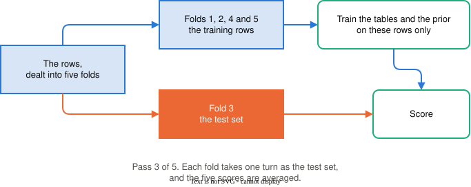

# Did it actually work? Evaluation and generalization {#sec-evaluation}
::: {.callout-warning title="Under construction"}
<!-- banner:under-construction -->
This chapter is drafted but **not yet instructor-reviewed**. Content may change without
notice until unit 6 opens — read ahead at your own risk.
:::


## The problem

Your rRNA filter from @sec-naive-bayes calls 94% of reads correctly. The core
facility, the shared laboratory that prepares and sequences libraries for
every group in the building, wants to put it in their standard pipeline.

A colleague asks one question before approving it: **"on which reads did you
measure that?"**

The honest answer is that the 94% came from 10,000 reads the simulation drew,
every one of them carrying a label we had written ourselves. The facility's
reads carry no labels at all. Nobody knows which of them are rRNA, which is
the reason they want the filter in the first place.

So the question has two halves. Had the filter already seen the reads it was
scored on? And did anyone know those reads' true classes? A number that fails
either half describes the measurement rather than the filter.

The 94% passes the first half, because @sec-naive-bayes scored on reads drawn
after training. It fails the second, and that is the half the facility cares
about. Evaluation has few tools for either problem: a split, a loop over
splits, a handful of ratios, and one diagnostic plot. Each one exists because
of a particular way a measurement goes wrong, and each of those failures is
built here on purpose, in a simulation where the true answer is known.

Before either half can be settled, the thing being measured has to be named,
and it is not the biology.

## The story

There is no new biology in this chapter. The process being modeled is the
**measurement of performance itself**: a model is built from one draw of reads
and will be used on another. A draw here is a whole dataset, the 100,000 reads
of @sec-naive-bayes, rather than the single yes-or-no draw that filled one
k-mer's slot in that chapter. Both draws come from the same process, but they are not
the same data. Anything the model absorbed about the *particular* reads it
saw, rather than about the process that generates reads, is worthless on the
next draw. Learning the process is called **generalization**. Absorbing the
draw is called **overfitting**.

The story therefore has two models. One learns the process. The other learns
the data. On the training draw the two are indistinguishable, and on a fresh
draw they separate. Everything in this chapter is a method for separating them
*before* deployment does it for you.

Two models that behave differently are a claim until there are two models to
run, so build them.

## The story, as code

Two models have to be built before they can be told apart, and both read their
data from the same place: a table of reads, with one row for each read and one
column for each k-mer.

### Reads as a table, one row each {#sec-evaluation-reads-as-a-table}

The reads of @sec-naive-bayes are rebuilt here as **a table, one row per read
and one column per k-mer**, which is the shape every dataset in this book
takes. The chapter works with 2,000 of them rather than the collaborator's
100,000, because every chunk below trains a model forty times over and 2,000
rows keep that quick.

```{python}
import numpy as np

rng = np.random.default_rng(61)
p_kmer = {"rRNA":  rng.uniform(0.15, 0.85, size=20),
          "non-rRNA": rng.uniform(0.15, 0.85, size=20)}

def one_read(share_rrna, p_kmer, rng):
    if rng.random() < share_rrna:
        label = "rRNA"
    else:
        label = "non-rRNA"
    present = rng.random(20) < p_kmer[label]
    return label, present

def make_reads(n_reads, share_rrna, p_kmer, rng):
    """A dataset: reads as rows of a matrix, labels alongside."""
    label_list, rows = [], []
    for _ in range(n_reads):
        label, present = one_read(share_rrna, p_kmer, rng)
        label_list.append(label)
        rows.append(present)
    return np.array(rows), np.array(label_list)

rng = np.random.default_rng(107)
X_train, y_train = make_reads(2000, 0.15, p_kmer, rng)
print(X_train[:3].astype(int))
print("rows and columns:", X_train.shape)
```

```{python}
print("row 0, one read:        ", X_train[0, :].astype(int))
print("column 3, one k-mer:    ", X_train[:8, 3].astype(int), "... (first 8 of 2,000)")
```

`X_train` holds the measurements, one row per read, and `y_train` holds that
row's class. The two letters are the field's: a capital for the table of measurements, a
lowercase for the labels beside it.
`X_train.shape` reports the table's dimensions, 2,000 rows and 20 columns.
From now on the shape is the first thing to ask of any array, because
**tracing shapes is how you read array code**, the way tracing values was how
you read loops. The rows a model is built from are its **training set**, which
is what the `_train` in the name says.

::: {.callout-important title="New Coding Concept: indexing a table"}
A table is indexed by two positions in one bracket, the row first and the
column second. `X_train[0, :]` is row 0, one read with all its k-mers.
`X_train[:, 3]` is column 3, one k-mer across all reads. A bare colon in
either seat means *all of them*, so read `X_train[:, 3]` aloud as *every row,
column 3*. The companion is `X_train.shape`, which reports the two counts as a
pair, rows first.

A mask may also go in the row seat on its own. `X_train[is_rrna]` keeps every
column of the rows where the mask is `True`, so the result is a smaller table
rather than a run of numbers. That form carries the fold loop later in the
chapter.
:::

A **reduction** collapses many numbers into fewer, as `.mean()` and `.sum()`
have done since @sec-simulating-a-process. On a table it needs a direction:

```{python}
print("k-mer 3, share of reads containing it:", X_train[:, 3].mean().round(3))
print("every k-mer at once:", X_train.mean(axis=0)[:4].round(2), "...")
```

The first line says about 65% of the 2,000 reads carry k-mer 3. The second runs the
same calculation for every k-mer at once: `axis=0` goes down the rows and
returns one answer per column, twenty presence rates from one line, of which
the print shows the first four.

::: {.callout-important title="New Coding Concept: axis="}
`axis=` tells a reduction which direction to run. The rule that keeps it
readable is that **the axis you name is the one that disappears.** Name axis 0
and the 2,000 rows collapse into twenty numbers, one per column;
`X_train.mean(axis=1)` would collapse the twenty columns instead and return one
number per read. If the count that comes back surprises you, the axis is the
wrong way round.
:::

The table is readable. The two models that will disagree about it are not
built yet.

### The model that learns the process {#sec-evaluation-learns-the-process}

The first model is naive Bayes, retrained here on the table form, with nothing
new about the method itself.

```{python}
def likelihood(present, probs):
    like = 1.0
    for i in range(len(probs)):
        if present[i]:
            like = like * probs[i]
        else:
            like = like * (1 - probs[i])
    return like

def train_presence(X, y, class_name):
    """Pseudocounted per-k-mer presence rates for one class."""
    is_class = (y == class_name)
    n_class = is_class.sum()
    probs = []
    for i in range(X.shape[1]):
        column = X[:, i]
        probs.append((column[is_class].sum() + 1) / (n_class + 2))
    return np.array(probs), n_class
```

```{python}
def nb_posterior(read, table_rrna, table_non, prior_rrna):
    score_r = likelihood(read, table_rrna) * prior_rrna
    score_n = likelihood(read, table_non) * (1 - prior_rrna)
    return score_r / (score_r + score_n)

def nb_accuracy(X, y, table_rrna, table_non, prior_rrna):
    correct = 0
    for read, truth in zip(X, y):
        if nb_posterior(read, table_rrna, table_non, prior_rrna) >= 0.5:
            call = "rRNA"
        else:
            call = "non-rRNA"
        if call == truth:
            correct += 1
    return correct / len(y)

table_rrna, n_rrna = train_presence(X_train, y_train, "rRNA")
table_non, n_non = train_presence(X_train, y_train, "non-rRNA")
prior_rrna = n_rrna / len(y_train)
```

Naive Bayes is the model that learns the process. The one that learns the data
is shorter.

### The model that learns the data {#sec-evaluation-learns-the-data}

The second model is @sec-mix's filtering move used as a classifier: to call a
read, look it up among the training reads and copy the label of its exact
matches.

```{python}
def memorizer(read, X_train, y_train):
    """Classify by exact lookup among the training reads."""
    agreements = (X_train == read).sum(axis=1)   # compares the read against
    exact = (agreements == 20)                   #   every row at once
    if exact.sum() == 0:
        return "non-rRNA"                           # unseen: answer the larger class
    from_rrna = (y_train[exact] == "rRNA")
    if from_rrna.mean() >= 0.5:
        return "rRNA"
    return "non-rRNA"

def memorizer_accuracy(X, y, X_train, y_train):
    correct = 0
    for read, truth in zip(X, y):
        if memorizer(read, X_train, y_train) == truth:
            correct += 1
    return correct / len(y)
```

One line in the memorizer deserves a name. `X_train == read` compares a single
read against every training row at once: numpy stretches the one row to the
table's shape and compares element by element, an operation called
**broadcasting**. It is used from here on whenever a row meets a table.

Both models are built, and neither has yet been asked about a read it did not
already have.

### The gap between the two scores {#sec-evaluation-the-gap}

Score both twice: once on the training set they were built from, and once on a
fresh draw from the same process.

```{python}
rng = np.random.default_rng(109)
X_fresh, y_fresh = make_reads(2000, 0.15, p_kmer, rng)

mem_train = memorizer_accuracy(X_train, y_train, X_train, y_train)
mem_fresh = memorizer_accuracy(X_fresh, y_fresh, X_train, y_train)
nb_train = nb_accuracy(X_train, y_train, table_rrna, table_non, prior_rrna)
nb_fresh = nb_accuracy(X_fresh, y_fresh, table_rrna, table_non, prior_rrna)
share_non = (y_fresh == "non-rRNA").mean()   # the share of the fresh draw that is non-rRNA
print(f"memorizer:    training {mem_train:.3f}   fresh {mem_fresh:.3f}   gap {mem_train - mem_fresh:.3f}")
print(f"naive Bayes:  training {nb_train:.3f}   fresh {nb_fresh:.3f}   gap {nb_train - nb_fresh:.3f}")
print(f"share of non-rRNA in the fresh draw: {share_non:.3f}")
```

|                 | on the training set | on a fresh draw |
|-----------------|--------------------:|----------------:|
| memorizer       |               1.000 |           0.855 |
| naive Bayes     |               0.936 |           0.938 |

: The memorizer's two scores differ by 0.145 and naive Bayes's by about zero, though the memorizer's training score is the higher of the four.

Read the table twice. On the training set the memorizer is *perfect*, because
every read matches itself. On fresh reads it falls to 0.855, two reads above
the 0.854 share of non-rRNA in the draw: nothing it stored transfers, so all
that remains is its majority-guess fallback, which answers non-rRNA because
non-rRNA is the larger class. Naive Bayes scores 0.936 and 0.938,
nearly the same number twice, because twenty presence rates estimated from two
thousand reads are, near enough, the process itself, and the process is the
same in the fresh draw.

The difference between a model's training score and its fresh score is the
**generalization gap**, and it is the object this chapter studies. The
two gaps are what separate the models: 0.145 for the memorizer and −0.001 for
naive Bayes. A gap is a difference between two estimates, so it can land on
either side of zero, and naive Bayes's fresh draw came out slightly easier than
its training set. The training scores, 1.000 and 0.936, rank the two
models the other way round.

The fresh draw did the separating, and outside a simulation there is no fresh
draw to be had.

## Playing with the story

Everything above rested on drawing a second sample on demand. The facility's
reads cannot be redrawn, so the second sample has to come out of the data
already in hand.

### Holding a slice back, and why once is not enough {#sec-evaluation-holding-back}

You will not usually have fresh data available, and the standard response is
to *make* some: hold back a slice of the data the model never sees, and let
that slice stand in for the future.

That slice is the **test set**, and what is left is the **training set** the
model is built from. The whole of the discipline is in the pair: the test set
is not looked at until the model is finished. A fresh draw does the same job
where one is available, so the second sample above was test data too, and from
here either is called a test set.

Split once and you get one number. A single test set is one draw of a random
quantity, though, and you know from @sec-simulating-a-process what one draw is
worth. So repeat it: cut the data into $k$ slices, called **folds**, and let
each take a turn as the test set. The $k$ of $k$ folds is a count of slices,
unrelated to the $k$ of k-mer that @sec-naive-bayes used. The repeated split is **cross-validation**,
and it is @sec-repeat's operation applied to evaluation itself.

The rotation is worth one look before the loop that does it.

{fig-alt="A flow diagram of one pass of five-fold cross-validation. At the left, a box labeled the rows, dealt into five folds. Two arrows leave it. The upper arrow goes to a box labeled folds 1, 2, 4 and 5, the training rows. The lower arrow goes to a box labeled fold 3, the test set. An arrow from the training rows goes to a box labeled train the tables and the prior on these rows only, and an arrow from that box goes to a box labeled score. A second arrow into score comes from the test set box. Beneath the diagram a line of text reads pass 3 of 5, each fold takes one turn as the test set, and the five scores are averaged."}

The picture is the loop, and the loop is twenty lines.

### The fold loop, and what it retrains {#sec-evaluation-the-fold-loop}

The loop below is the figure in twenty lines. It deals the fold ids the way
cards go round a table: a counter runs 0, 1, 2, 3, 4 and starts over, so row 0
lands in fold 0, row 1 in fold 1, and row 5 back in fold 0. Watch which rows
each pass is allowed to see.

```{python}
def five_fold_scores(X, y):
    """Five held-out accuracies: each fold takes one turn as the test set."""
    fold_list = []
    fold = 0
    for _ in range(len(y)):
        fold_list.append(fold)
        fold += 1
        if fold == 5:
            fold = 0
    fold_id = np.array(fold_list)
    scores = []
    for k in range(5):
        in_test = (fold_id == k)
        in_train = (fold_id != k)
        t_r, _ = train_presence(X[in_train], y[in_train], "rRNA")
        t_n, _ = train_presence(X[in_train], y[in_train], "non-rRNA")
        prior = (y[in_train] == "rRNA").mean()   # the rRNA share of this fold's training rows
        scores.append(nb_accuracy(X[in_test], y[in_test], t_r, t_n, prior))
    return np.array(scores)

scores = five_fold_scores(X_train, y_train)
print("fold scores:", scores.round(3))
print(f"mean {scores.mean():.3f}   sd {scores.std():.3f}")
```

Each fold takes its turn as the **test fold** while the other four supply the
training rows, so every row is scored exactly once and trained on four times.
Note what the fold loop retrains: *everything*, tables and prior
alike, from only that fold's training rows. The test fold's rows touch nothing.
@sec-evaluation-selection-before-split shows what one step that sees the test
fold costs.

::: {#toolbox-evaluation .callout-important title="Toolbox"}
The loop above is two library calls. In `scikit-learn`, `KFold` deals the fold
ids and `cross_val_score` runs the loop, refitting the estimator on each fold's
training rows exactly as the hand-rolled version does.

```{python}
from sklearn.model_selection import KFold, cross_val_score
from sklearn.naive_bayes import BernoulliNB

splitter = KFold(n_splits=5)                   # contiguous blocks, not a turn-by-turn deal
library_scores = cross_val_score(BernoulliNB(alpha=1), X_train, y_train,
                                 cv=splitter)
our_scores = five_fold_scores(X_train, y_train)
print("library:", library_scores.round(3), f"  mean {library_scores.mean():.3f}")
print("ours:   ", our_scores.round(3), f"  mean {our_scores.mean():.3f}")
```

The two sets of five do not match, because `KFold` deals its folds in
contiguous blocks where the loop above deals them one row at a time in turn.
The five training sets are therefore not the same five, and a fold score
measured on 400 test reads moves by a hundredth or so between one deal and
another. The quantity being estimated is the same, and the two means differ by
0.002. `KFold` takes `shuffle=True` when the rows
arrive in an order that means something.
:::

The loop produces a number. Nothing so far says whether it is the right one.

### Grading the evaluators against a known truth {#sec-evaluation-grading-evaluators}

Because the data is simulated, one more move is available that real data never
offers: grade the evaluation procedures themselves. Train on a draw, then
measure the model's *true* accuracy on a very large fresh draw, and ask how
close each procedure's estimate came.

```{python}
rng = np.random.default_rng(113)
err_train, err_split, err_cv = [], [], []
for _ in range(40):
    X, y = make_reads(800, 0.15, p_kmer, rng)
    t_r, _ = train_presence(X, y, "rRNA")
    t_n, _ = train_presence(X, y, "non-rRNA")
    prior = (y == "rRNA").mean()                 # the rRNA share of this draw
    X_big, y_big = make_reads(5000, 0.15, p_kmer, rng)
    true_acc = nb_accuracy(X_big, y_big, t_r, t_n, prior)
    err_train.append(nb_accuracy(X, y, t_r, t_n, prior) - true_acc)
    t2_r, _ = train_presence(X[:600], y[:600], "rRNA")
    t2_n, _ = train_presence(X[:600], y[:600], "non-rRNA")
    prior2 = (y[:600] == "rRNA").mean()      # the rRNA share of the 600 training rows
    err_split.append(nb_accuracy(X[600:], y[600:], t2_r, t2_n, prior2) - true_acc)
    err_cv.append(five_fold_scores(X, y).mean() - true_acc)

for name, errors in (("training score", err_train),
                     ("600/200 split", err_split),
                     ("five-fold CV", err_cv)):
    e = np.array(errors)
    print(f"{name:>15}: error {e.mean():+.3f}   spread {e.std():.3f}")
```

| procedure          |  error | spread of the error |
|--------------------|-------:|--------------------:|
| the training score | +0.005 |               0.010 |
| one 600/200 split  | +0.003 |               0.016 |
| five-fold CV       | −0.001 |               0.010 |

: The training score runs optimistic; one split is centered but wanders twice as far as five-fold cross-validation does.

The three rows carry three lessons. The training score runs optimistic. Its $+0.005$ is small here only because
naive Bayes has forty presence rates and one share to store anything in; give a
model more room and the same column grows, as the memorizer's $+0.145$ showed.
The other two errors, $+0.003$ and $-0.001$, are smaller than the spread of
their own columns, so neither leans in a direction the forty draws can
distinguish from zero. The single split is unbiased but noisy. Its estimate wanders
nearly twice as far as CV's, because it is one draw where CV averages five.
Five-fold CV is both centered and steadiest, which is why it is the
default answer to *"on which reads did you measure that?"* for everything
the rest of this book fits.

A centered estimate of accuracy is still an estimate of accuracy, and accuracy
is one number about a table with four cells.

## Where the numbers come from

A single accuracy, however carefully measured, is still one number standing in
for four counts. Those four counts, and the three ratios built from them, are
what a decision about the filter actually turns on.

### Four cells under one number {#sec-evaluation-four-cells}

For a deployed filter the four cells have names. A read called rRNA that truly
is rRNA is a **true positive**, `tp`. One called rRNA that is not is a **false
positive**, `fp`. A read called non-rRNA that truly is non-rRNA is a **true
negative**, `tn`. One called non-rRNA that was really rRNA is a **false
negative**, `fn`. Different mistakes cost different amounts, and a discarded
good read is a different loss from a kept rRNA read:

```{python}
tp = fp = tn = fn = 0
for read, truth in zip(X_fresh, y_fresh):
    called_rrna = (nb_posterior(read, table_rrna, table_non, prior_rrna) >= 0.5)
    if called_rrna and truth == "rRNA":
        tp += 1
    elif called_rrna and truth == "non-rRNA":
        fp += 1
    elif truth == "rRNA":
        fn += 1
    else:
        tn += 1
sensitivity = tp / (tp + fn)
specificity = tn / (tn + fp)
ppv = tp / (tp + fp)
print(f"called rRNA: {tp} truly rRNA, {fp} truly non-rRNA")
print(f"called non-rRNA: {fn} truly rRNA, {tn} truly non-rRNA")
print(f"truly rRNA in all: {tp + fn}")
print(f"sensitivity {sensitivity:.2f}   specificity {specificity:.2f}   PPV {ppv:.2f}")
```

The four counts laid out by truth and by call are a **confusion table**, the
standard way the field reports a classifier's mistakes.

|                     | called rRNA | called non-rRNA |
|---------------------|------------:|----------------:|
| **truly rRNA**      |         211 |              82 |
| **truly non-rRNA**  |          42 |           1,665 |

: Behind a 94% accuracy, 82 of the 293 truly rRNA reads were called non-rRNA.

**Sensitivity** is the share of the truly rRNA reads that were caught, 0.72
here, meaning that this filter at this threshold misses more than a quarter of
its target. **Specificity** is the share of the good reads correctly kept,
0.98. **PPV** (positive predictive value) is the share of the reads *called*
rRNA that really are rRNA, 0.83. The same classifier that reports 94% accuracy
carries a 0.72 in its sensitivity row, because accuracy averages the cells
by their sizes, and the class you care about is the small one.

Fifteen percent of reads being rRNA is a heavily contaminated library, and the
facility's are not.

### Accuracy at one percent {#sec-evaluation-at-one-percent}

Push the imbalance to its limit. The removal step of @sec-naive-bayes, which
the field calls **depletion**, can leave rRNA at 1% of reads, and at that
share accuracy stops meaning anything at all:

```{python}
rng = np.random.default_rng(127)
X_a, y_a = make_reads(2000, 0.01, p_kmer, rng)   # training data, 1% rRNA
X_b, y_b = make_reads(2000, 0.01, p_kmer, rng)   # fresh data to grade on
# the share of the fresh data that is non-rRNA, which is what always-non-rRNA scores
print("accuracy of always answering 'non-rRNA':", (y_b == "non-rRNA").mean())

t_r, _ = train_presence(X_a, y_a, "rRNA")
t_n, _ = train_presence(X_a, y_a, "non-rRNA")
prior = (y_a == "rRNA").mean()           # the rRNA share of the training data
tp = fn = 0
for read, truth in zip(X_b, y_b):
    if truth == "rRNA":
        if nb_posterior(read, t_r, t_n, prior) >= 0.5:
            tp += 1
        else:
            fn += 1
print(f"trained filter: accuracy {nb_accuracy(X_b, y_b, t_r, t_n, prior):.4f},"
      f" but catches {tp} of {tp+fn} rRNA reads")
```

A classifier that answers "non-rRNA" for every read scores 0.9865. The trained
filter scores 0.9885, numerically better, while catching 5 of the 27 reads it
exists to catch. At real imbalance, report the confusion table's rows rather
than their average.

The 0.5 that decided every one of those calls was a choice rather than a fact.

### Sliding the threshold {#sec-evaluation-sliding-the-threshold}

The sensitivity and specificity pair moves as you slide that threshold: catch
more rRNA by accepting more false alarms. The standard picture of that trade
follows:

```{python}
#| fig-cap: "The threshold trade on fresh reads: each point is one cutoff. The marked point is the 0.5 threshold used above."
import matplotlib.pyplot as plt

posteriors, is_rrna_list = [], []
for read, truth in zip(X_fresh, y_fresh):
    posteriors.append(nb_posterior(read, table_rrna, table_non, prior_rrna))
    is_rrna_list.append(truth == "rRNA")
posteriors = np.array(posteriors)
is_rrna = np.array(is_rrna_list)

fig, ax = plt.subplots(figsize=(4.6, 4.2))
for cut in np.arange(0.05, 1.0, 0.05):
    called = (posteriors >= cut)
    sens = called[is_rrna].mean()                # the share of rRNA reads caught
    is_not_rrna = (is_rrna == False)
    false_alarm = called[is_not_rrna].mean()         # 1 - specificity
    if abs(cut - 0.5) < 0.01:
        color = "#eb6834"          # the 0.5 threshold used above
    else:
        color = "#2a78d6"
    ax.plot(false_alarm, sens, "o", color=color, ms=6)
ax.plot([0, 1], [0, 1], ls=":", color="#898781", lw=1)
ax.set_xlabel("false-alarm rate (1 − specificity)")
ax.set_ylabel("sensitivity")
ax.spines[["top", "right"]].set_visible(False)
plt.show()
```

The dotted diagonal is what a coin flip would score, and distance above it is
the separation the filter achieves between the two classes. The curve is worth
reading whole. Summarizing it as a single number averages over thresholds you
will never deploy, and the threshold you do deploy, marked here at 0.5, is the
one whose sensitivity and specificity you have to live with.

Every number so far grades the call. @sec-naive-bayes left a question about
the number attached to it.

### Claimed confidence against observed frequency {#sec-evaluation-calibration}

A naive model's posteriors can rank reads well while their values sit far from
the frequencies they name, which is what @sec-naive-bayes showed under doubled
evidence. So measure the values rather than the ranking. Collect predictions
into bins by claimed probability, and within each bin count how often the claim
came true. That comparison is called **calibration**:

```{python}
def calibration_table(posteriors, truths):
    rows = []
    for low in (0.0, 0.2, 0.4, 0.6, 0.8):
        from_floor_up = posteriors >= low        # every call at or above the bin's floor
        bin_posteriors = posteriors[from_floor_up]
        bin_truths = truths[from_floor_up]
        under_ceiling = bin_posteriors < low + 0.2   # of those, the ones below its ceiling
        bin_posteriors = bin_posteriors[under_ceiling]
        bin_truths = bin_truths[under_ceiling]
        if len(bin_posteriors) > 0:
            claimed = bin_posteriors.mean()
            observed = (bin_truths == "rRNA").mean()   # how often this bin was right
            rows.append((claimed, observed, len(bin_posteriors)))
    return rows

independent_bins = calibration_table(posteriors, y_fresh)
for claimed, observed, n in independent_bins:
    print(f"claimed {claimed:.2f}   observed {observed:.2f}   calls {n}")
```

| claimed | observed | calls in the bin |
|--------:|---------:|-----------------:|
|    0.02 |     0.03 |            1,619 |
|    0.28 |     0.31 |               93 |
|    0.49 |     0.41 |               63 |
|    0.69 |     0.72 |               58 |
|    0.93 |     0.92 |              167 |

: With independent k-mers the claimed probabilities track the observed frequencies; the loosest bin, 0.49 against 0.41, is also the one holding fewest calls.

Claimed 0.93, observed 0.92; claimed 0.02, observed 0.03. The middle bin is
the loosest, 0.49 claimed against 0.41 observed, and it holds 63 calls against
the top bin's 167, so a gap that size is what 63 calls can produce on their
own. When the independence assumption matches the data, the claimed
probabilities land close to the frequencies they name.
Now the data from @sec-naive-bayes's failure section, ten real k-mers each
reported twice, where the assumption is violated by construction:

```{python}
def one_read_doubled(share_rrna, p_kmer, rng):
    if rng.random() < share_rrna:
        label = "rRNA"
    else:
        label = "non-rRNA"
    coins = rng.random(10) < p_kmer[label][:10]
    present = []
    for c in coins:
        present.append(c)
    for c in coins:
        present.append(c)
    return label, np.array(present)

rng = np.random.default_rng(131)
rows, labs = [], []
for _ in range(2000):
    label, present = one_read_doubled(0.15, p_kmer, rng)
    rows.append(present)
    labs.append(label)
X_dbl, y_dbl = np.array(rows), np.array(labs)
```

```{python}
d_r, _ = train_presence(X_dbl, y_dbl, "rRNA")
d_n, _ = train_presence(X_dbl, y_dbl, "non-rRNA")
d_prior = (y_dbl == "rRNA").mean()   # the rRNA share of the doubled-evidence data

rng = np.random.default_rng(137)
rows, labs = [], []
for _ in range(2000):
    label, present = one_read_doubled(0.15, p_kmer, rng)
    rows.append(present)
    labs.append(label)
X_dbl2, y_dbl2 = np.array(rows), np.array(labs)
d_posts = []
for read in X_dbl2:
    d_posts.append(nb_posterior(read, d_r, d_n, d_prior))
d_posts = np.array(d_posts)

doubled_bins = calibration_table(d_posts, y_dbl2)
top_claimed, top_observed, top_n = doubled_bins[len(doubled_bins) - 1]
print(f"duplicated k-mers, top bin: claimed {top_claimed:.2f}"
      f"   observed {top_observed:.2f}   calls {top_n}")
```

```{python}
#| fig-cap: "Calibration: claimed confidence against observed frequency. With independent k-mers the points track the diagonal; with duplicated k-mers the claimed probabilities near 0.94 are observed at 0.68."
fig, ax = plt.subplots(figsize=(4.6, 4.2))
for table, color, name in [(independent_bins, "#2a78d6", "independent k-mers"),
                           (doubled_bins, "#eb6834", "duplicated k-mers")]:
    claimed_list, observed_list = [], []
    for claimed, observed, n in table:
        claimed_list.append(claimed)
        observed_list.append(observed)
    ax.plot(claimed_list, observed_list, "o-", color=color, lw=2, label=name)
ax.plot([0, 1], [0, 1], ls=":", color="#898781", lw=1)
ax.set_xlabel("claimed P(rRNA)")
ax.set_ylabel("observed frequency of rRNA")
ax.legend(frameon=False)
ax.spines[["top", "right"]].set_visible(False)
plt.show()
```

The duplicated-k-mer curve sits below the diagonal everywhere above 0.5: every
confident claim is delivered less often than stated, with 0.94 claimed and 0.68
observed.
This plot is the instrument that catches @sec-naive-bayes's failure, and it
needs no access to the model's insides, because predictions and outcomes are
enough. When a tool hands you probabilities, this plot is the picture to demand
before believing them.

Accuracy, the three confusion ratios, the threshold curve and calibration: the
chapter's measurements are all in hand, and none has been written down in the
compressed form the literature uses.

## The notation

The notation is light in this chapter. A dataset splits into
$\mathcal{D}_{\text{train}}$ and $\mathcal{D}_{\text{test}}$, and a score
measured on each gives the **generalization gap**
$\text{acc}_{\text{train}} - \text{acc}_{\text{test}}$. In $k$-fold
cross-validation the data is cut into folds $F_1, \dots, F_k$ and the
reported score is

$$
\text{CV} \;=\; \frac{1}{k}\sum_{j=1}^{k} \text{acc}\!\left(\,\text{model trained on } \mathcal{D} \setminus F_j,\ \text{scored on } F_j\right)
$$

$\mathcal{D} \setminus F_j$ reads "the data *without* fold $j$", and the
formula's whole content is the discipline you already coded: everything
trained inside the sum sees only its own $\mathcal{D} \setminus F_j$. The
three confusion ratios are written out of the four cells: sensitivity
$tp/(tp+fn)$, specificity $tn/(tn+fp)$, PPV $tp/(tp+fp)$.

Every one of those symbols assumes the procedure around it kept the test data
out, and that assumption has not been tested yet.

## When the model is wrong

This chapter's failures are in the *protocol* rather than in the classifier:
ways of arranging correct steps into a misleading measurement. Each one below
produced a high number from nothing, in code where every
individual line is correct.

The first is the one that appears most often in print.

### Selection before the split {#sec-evaluation-selection-before-split}

Sixty patients, each measured at 1,500 places, with case or control settled by
a coin flip; the flips fell 32 to 28. A measured place is a **feature**, the
role the twenty k-mers played above, and here every one of the 1,500 is its own
coin flip, carrying no relation to the labels. So the best attainable accuracy
is a coin flip, and we know it because we built the data. The
pipeline keeps the 20 features most separated between the groups, then trains
and evaluates with a clean split:

```{python}
rng = np.random.default_rng(191)
noise_rows, label_list = [], []
for _ in range(60):
    noise_rows.append(rng.random(1500) < 0.5)
    if rng.random() < 0.5:
        label_list.append("case")
    else:
        label_list.append("control")
X_noise = np.array(noise_rows)
y_noise = np.array(label_list)
n_cases = (y_noise == "case").sum()          # how the coin flips actually fell
print(f"{n_cases} cases and {60 - n_cases} controls")

def top_columns(X, y, how_many):
    """Positions of the columns most separated between the two groups."""
    is_case = (y == "case")
    is_control = (y == "control")
    gaps = []
    for j in range(X.shape[1]):
        column = X[:, j]
        gaps.append(np.abs(column[is_case].mean() - column[is_control].mean()))
    order = np.argsort(np.array(gaps))     # positions, worst separation first
    return order[len(order) - how_many:]   # the last 20: the best separated
```

::: {.callout-important title="New Coding Concept: argsort"}
`np.argsort(gaps)` returns the **positions** that would sort the array, never
the sorted values themselves. It is the ranking relation of the `argmax` you
met in @sec-nest, which returns one position; `argsort` returns all of them,
smallest value first. Read `order[len(order) - how_many:]` aloud as *the last
twenty entries of the ranking*, which are the positions of the twenty largest
gaps.
:::

```{python}
def split_accuracy(X, y):
    """Train a two-class NB on the first half, score on the second."""
    X_tr, y_tr = X[:30], y[:30]
    X_te, y_te = X[30:], y[30:]
    in_case = (y_tr == "case")
    in_control = (in_case == False)
    p_case, p_ctrl = [], []
    # each column's presence rate within each group, pseudocounted
    for j in range(X_tr.shape[1]):
        column = X_tr[:, j]
        p_case.append((column[in_case].sum() + 1) / (in_case.sum() + 2))
        p_ctrl.append((column[in_control].sum() + 1) / (in_control.sum() + 2))
    p_case, p_ctrl = np.array(p_case), np.array(p_ctrl)
    prior_case = in_case.mean()                    # the share of training rows that are cases
    correct = 0
    for row, truth in zip(X_te, y_te):
        score_case = likelihood(row, p_case) * prior_case
        score_ctrl = likelihood(row, p_ctrl) * (1 - prior_case)
        if score_case >= score_ctrl:
            call = "case"
        else:
            call = "control"
        if call == truth:
            correct += 1
    return correct / len(y_te)
```

```{python}
selected = top_columns(X_noise, y_noise, 20)         # selection saw all sixty rows
print("leaky pipeline, held-out accuracy:", round(split_accuracy(X_noise[:, selected], y_noise), 2))

repaired_cols = top_columns(X_noise[:30], y_noise[:30], 20)   # selection saw the training half only
print("repaired pipeline, held-out accuracy:",
      round(split_accuracy(X_noise[:, repaired_cols], y_noise), 2))
```

**0.97 on pure noise.** The split was clean and the training was clean; the
selection was the leak. The separation statistic was computed over all sixty rows, so the
thirty held-out rows helped choose which columns survived. With 1,500
noise columns to choose from, twenty will separate any labeling of sixty
points well, including this meaningless one. Move the selection inside the
training half, a change of one line, and the same code reports 0.47: a coin
flip, which is the truth. The pattern is called **leakage**. Any computation
that touches the held-out data before evaluation, however innocent it looks
(feature selection, normalization statistics, threshold choice), converts test
data into training data. Wrapping the leaky version in five-fold CV would not
have helped, because the selection had already seen every fold.

That diagnosis needed the source. Inheriting the pipeline without it is the
ordinary case.

### Labels that mean nothing {#sec-evaluation-permutation-null}

There is an instrument that finds manufactured scores without reading the
code: **give the pipeline labels that mean nothing and see what it scores.**
Shuffle the labels and rerun everything, selection included. The shuffle is
built from `argsort`: draw one random number per row, then rank them. Because
the random numbers arrive in no order, their ranking is a random ordering of
the sixty positions.

```{python}
rng = np.random.default_rng(157)
null_scores = []
for _ in range(15):
    shuffle = np.argsort(rng.random(60))    # a random ordering of positions
    y_null = y_noise[shuffle]               # the same labels, dealt to random rows
    cols = top_columns(X_noise, y_null, 20)
    null_scores.append(split_accuracy(X_noise[:, cols], y_null))
null_scores = np.array(null_scores)
print("the leaky pipeline, on meaningless labels:", null_scores.round(2))
print(f"mean {null_scores.mean():.2f}")
```

With labels dealt at random, no relationship to the features survives, by
construction, and the pipeline still scores 0.92 on average, reaching as high
as 0.97. Fifteen shuffles is a small null: as in @sec-repeat, a count over
fifteen runs cannot report anything finer than one in fifteen, which is enough
here because the question is whether the score is ordinary, not how rare it
is. Its real-label score of 0.97 now reads correctly: *this pipeline
produces 0.9 and up for anything*, so its 0.97 contains no evidence at all.
The shuffled-label distribution is the **permutation null**, and it is
@sec-repeat's chain with a new hypothesis. The null hypothesis is that the
labels are exchangeable: any assignment of labels to rows was as likely as
the observed one. The null model is the shuffle, which keeps every measurement
exactly as observed and randomizes only which row carries which label. The
null distribution is the set of scores the pipeline produces under that
shuffle. Nothing about how the measurements arose had to be written down,
which is why this null can be run on any pipeline you inherit. It does make
one assumption, exchangeability, and that assumption has its own failure.

Exchangeability fails when the samples are structured. If the cases were
processed in one batch and the controls in another, or if samples are
correlated neighbors, then shuffling labels freely produces arrangements the
real process could never have produced, and the null distribution is wrong.
The remedy is to shuffle within the structure, for example within each batch.
The permutation null is used for the rest of the book, and this assumption
travels with it.

The leak above was in the code. The next one is in the hands of the person
reading the score.

### The test set consulted twice {#sec-evaluation-test-set-reuse}

A test set you consult twice is training data. Tune a
threshold on the held-out slice, look at the score, adjust a feature list, and
look again. Each look leaks a little, and after twenty adjustments the
"held-out" score is a fit to the test set, arrived at by hand. The pattern is
@sec-repeat's direction-after-looking applied to evaluation: the data that
chose the method cannot also grade it. The repair is structural: a final test
set that is consulted once, after every decision is frozen, and a development
set that absorbs all the looking.

Both of those are failures of how the measurement was run. The third needs no
mistake at all.

### When the data moves {#sec-evaluation-distribution-shift}

Preparing a library attaches short known sequences, called **adapters**, to
every fragment. Train the rRNA filter on one preparation, then deploy it on a
batch where leftover adapter sequence adds spurious k-mer hits to every read:

```{python}
strength = 0.4
p_prepB = {"rRNA":  p_kmer["rRNA"] + (1 - p_kmer["rRNA"]) * strength,
           "non-rRNA": p_kmer["non-rRNA"] + (1 - p_kmer["non-rRNA"]) * strength}
rng = np.random.default_rng(151)
X_shift, y_shift = make_reads(2000, 0.15, p_prepB, rng)
print("accuracy on its own prep:  ",
      round(nb_accuracy(X_fresh, y_fresh, table_rrna, table_non, prior_rrna), 3))
print("accuracy on the new prep:  ",
      round(nb_accuracy(X_shift, y_shift, table_rrna, table_non, prior_rrna), 3))
```

The line `p + (1 - p) * 0.4` pushes every presence rate four tenths of the way
from where it was to 1, which is what extra k-mer hits on every read would do.
Accuracy falls from 0.938 to 0.844, and nothing announced it: no error, no
warning, a plausible-looking accuracy, and one read in six now wrong in
production. Every
number this chapter taught you to compute is a property of *a model and a
distribution together*. A test set measures the model against the distribution
the test set was drawn from. When the incoming reads move away from that
distribution, the measurement stops applying, and the test set cannot report
this, because it was drawn before the move. The
defenses are @sec-nest's: know which quantities your rule assumed fixed,
and monitor them where they can drift.

Selection, reuse and shift: three ways a protocol produces a number that does
not describe the model. The colleague's question is still waiting for its answer.

## What do we tell our collaborator?

The question was *on which reads did you measure that?*, and both halves of it
can now be answered with numbers this chapter measured.

### The answer, measured properly {#sec-evaluation-the-answer}

Take the first half first. The filter scores 0.938 on reads it has never seen,
against 0.936 on the ones it was built from, so it had not simply stored its
training rows. Five-fold cross-validation, which uses the
training data alone, gives 0.933 with a spread of 0.011 across its folds.
Three procedures, three numbers within half a point of each other. Naive Bayes
holds forty presence rates and one share, which is far too few to store two
thousand reads in.

The accuracy survived. What changed is the account of what the filter does with
the class it was built to find: sensitivity 0.72, specificity 0.98, PPV 0.83.
The filter keeps good reads reliably and misses more than a quarter of the rRNA
it exists to remove. The 0.72 is the number the facility's decision turns on.

The second half is the harder one, and this chapter cannot close it from
simulated reads alone: every number above was measured where we wrote the
labels ourselves. What it can do is name the measurement the facility has to
make on its own data, which is the subject of the recommendation below.

The confidence audit @sec-naive-bayes asked for also comes out well here. The
filter's claimed probabilities track the frequencies they refer to, 0.93
claimed against 0.92 observed in the top bin, so on reads like these the
probabilities can be reported as well as the calls.

Those numbers answer the question for a library like the one the filter was
trained on. The facility's libraries are not like it.

### Two answers, side by side {#sec-evaluation-two-answers}

The two measurement procedures said different things about the same two
filters, and the difference is what the first half of the question turns on.

On naive Bayes, the training score claimed 0.936 and the held-out score says
0.938. The two are near enough identical, and a colleague who reported only the
first would have been right by luck. On the memorizer, the same two procedures
said 1.000 and 0.855. Which of those two cases you are holding is readable
only from the held-out score, so that is the number the report carries.

The facility asked about a pipeline rather than about a filter in isolation,
and a pipeline runs on their libraries, not on ours.

### The sensitivity floor the facility needs {#sec-evaluation-what-next}

A recommendation that the facility can act on has to be written in the quantity
that fails first, which the imbalance section already identified.

At the depletion level a well-run facility reaches, around 1% rRNA, the filter
catches 5 of the 27 rRNA reads in two thousand. Its accuracy there is 0.9885,
against the 0.9865 reached by the rule that labels every read non-rRNA. An acceptance rule has to be written in sensitivity, because one written in
accuracy passes a filter that catches 5 of 27.

So the number to put in the recommendation is a per-batch sensitivity floor,
measured on a small set of reads labeled the way @sec-naive-bayes's training
reads were, by aligning each one against a known rRNA reference, and measured
again whenever the library preparation changes. The observed 0.72 at 15% rRNA is the
starting point for setting that floor, and the 1% result is the warning about
where sensitivity goes when the target class gets rare.

That recommendation holds for as long as the batches keep arriving from the
same process.

### The shift that nothing announces {#sec-evaluation-residual}

One failure in this chapter is not answered by anything in the recommendation
above, and the report should say so rather than leave it to be discovered.

Moving the filter to a preparation with an adapter artifact took it from 0.938
to 0.844, and nothing announced the change. No held-out slice catches that,
because the slice came from the old distribution too. Monitoring the inputs is
the only defense, and it belongs in the pipeline rather than in the evaluation.

Four things go in the report:

1. Measure on reads the model has not seen, and say which reads those were.
2. Report the confusion table's rows rather than their average whenever the
   classes are imbalanced, which for rRNA they always are.
3. Check that claimed confidences are delivered before passing them to anyone.
4. Watch the inputs for drift, because every number here is a property of a
   model and a distribution together.

None of those four lines is specific to a filter for rRNA, and none of them
has yet been carried out on a read the facility actually produced.

## Practice problems

Ungraded, solutions worked. Do them before looking.

### 6.1 · Predict the output {#sec-evaluation-p1}

The evaluator-grading chunk reports one row per procedure, an error and a
spread. Before rerunning it with a 300/100 split instead of 600/200: which of
those numbers change materially, in which direction, and why? Then edit and
run.

::: {.callout-tip collapse="true" title="Worked solution"}
The one-split row's *spread* grows. Its test slice drops from 200 reads to
100, and an accuracy estimated on 100 reads wanders roughly $\sqrt{2}$ wider
than one estimated on 200, which is @sec-simulating-a-process's depth lesson
applied to the evaluator. Its bias also drifts slightly pessimistic, because
training on 300 reads instead of 600 gives a genuinely worse model than the
full-data one being graded. The training-score and CV rows barely move,
because neither uses the split. The general rule is that a held-out estimate
has its own sampling variability, and the *test* count sets it.
:::

### 6.2 · Modify the story {#sec-evaluation-p2}

Take the leaky pipeline and repair it by moving *only* the selection step.
Then explain to a skeptical colleague why the "worse" number is the better pipeline, using the permutation run as
your evidence.

::: {.callout-tip collapse="true" title="Worked solution"}
The repair is `top_columns(X_noise[:30], y_noise[:30], 20)`, so that
selection sees only the training half, and the score drops from 0.97 to 0.47.
The argument is to run both pipelines on shuffled labels. The leaky one scores
about 0.92 on labels that mean nothing, so its 0.97 measures how well it fits
*any* labels. The repaired one scores around 0.5 on shuffled labels, and its
0.47 on real ones is one noisy draw around the coin-flip truth of a noise
dataset. A score is evidence only when the same pipeline scores lower on labels that
mean nothing, which is the comparison the permutation run supplies.
:::

### 6.3 · Hand-calculate {#sec-evaluation-p3}

A screening tool on 10,000 samples: 100 truly positive, of which it
catches 90; it also flags 396 of the 9,900 negatives. Compute sensitivity,
specificity, and PPV by hand. Then keep both rates fixed and recompute PPV
at 10 true positives in 10,000.

::: {.callout-tip collapse="true" title="Worked solution"}
Sensitivity $= 90/100 = 0.90$. Specificity $= 9504/9900 = 0.96$. PPV
$= 90/(90+396) \approx 0.185$, so more than four flags in five are false
already. At 10 in 10,000: the tool catches 9 and false-flags
$0.04 \times 9990 \approx 400$, so PPV $= 9/409 \approx 0.022$, about
forty-five flags per true positive, from the *same tool*. Sensitivity and
specificity are properties of the tool. PPV is a property of the tool *in a
population*, because it has a prior in it, which is @sec-mix's lesson in an
evaluation setting.
:::

### 6.4 · Spot the mismatch {#sec-evaluation-p4}

A pipeline, each step individually correct: (1) compute each column's mean
and spread on the full dataset, and standardize the columns; (2) split
80/20; (3) train on the 80; (4) report accuracy on the 20. The authors note that feature selection happens nowhere. Where is the leak,
and how big do you expect it to be?

::: {.callout-tip collapse="true" title="Worked solution"}
Step 1: the standardization *statistics* were computed on all rows, so
every training-set column was scaled using the test rows' means and spreads,
and the test data participated in preprocessing. The leak is real but usually
small. Two thousand rows' means barely move when twenty rows are excluded, so
expect a small effect rather than the 0.97-on-noise result: selection leaks
*choices* (which features exist), and standardization leaks only *statistics*.
The discipline that needs no case-by-case judgment is that anything estimated
from data (means, spreads, thresholds, feature lists) is part of the model,
and is refit inside each training set. The permutation null decides when you
are unsure whether a leak matters.
:::

### 6.5 · Read the notation {#sec-evaluation-p5}

Translate into a loop, stating what is recomputed inside it and what must
never be:

$$
\text{CV} = \frac{1}{5}\sum_{j=1}^{5} \text{acc}\!\left(\text{model trained on } \mathcal{D}\setminus F_j,\ F_j\right)
$$

::: {.callout-tip collapse="true" title="Worked solution"}
The loop is `five_fold_scores`. For each $j$, a mask picks fold $j$ as test
and its complement as train. *Everything learned from data*, meaning the
presence tables, the prior, and any selection or scaling step had there been
one, is recomputed from $\mathcal{D}\setminus F_j$ inside the loop. The
accuracy is scored on $F_j$, and the five results are averaged. Nothing must be
kept out of the loop; the risk runs the other way. What must never be computed
*outside* the loop is anything data-derived, since computing it once on all of
$\mathcal{D}$ is exactly the leak of problem 6.4. The notation's
$\mathcal{D}\setminus F_j$ marks the boundary of what the model may see, and
the loop body is that boundary, enforced.
:::

## A worked design

A core facility is offered a published classifier for single-cell RNA-seq and
has to decide whether to adopt it. The same four steps as the chapters before,
on data nobody in the room has labels for.

> **The problem.** A published cell-type classifier for single-cell RNA-seq,
> trained by another lab on another instrument in another tissue atlas, is a
> candidate for your core facility's standard pipeline. Retraining is not an
> option: the authors ship fixed weights, and the facility wants a yes or no
> with evidence. Design the evaluation.

**Frame.** Nothing is being fit. The unknown is a *number*, this tool's
performance on *our* data, and the entire risk is @sec-nest's lesson: a rule
calibrated on one distribution, applied to another. Their data and ours differ
in instrument chemistry, tissue mix, and depth, so their reported accuracy is a
fact about their data and says nothing certain about ours. The design's product
is an estimate of performance here, with the distribution shift measured rather
than assumed away. Labels are the bottleneck. We have no ground truth for our
own cells, and that gap is the central difficulty, so the design is to obtain a
small amount of truth.

**Decompose.** (1) A labeled anchor set: a few hundred of our cells annotated by
two independent human experts, with disagreements adjudicated. It is expensive
and small, and it is the only thing here that deserves the word truth. (2)
Overall and per-class sensitivity on that anchor set. Per-class matters because
a cell-type mix is severely imbalanced, and the rare types are why the facility
wants automation at all. (3) Calibration of the tool's reported confidences
against the anchor labels. The diagonal plot decides whether its confidence
field is usable or must be removed from reports. (4) A shift probe: compare the
tool's confidence distribution on our full data with the one in its
publication. A tool that is much less confident on our cells is showing that
our data differs from its training data. (5) The acceptance rule, written
before measuring: what per-class sensitivity, at what calibration, is enough.
Deciding now keeps the rule from drifting toward whatever the tool happens to
score.

**Select.** Fixed-weights evaluation against a human-labeled anchor set, with
per-class reporting and a calibration audit. The rejected alternative is the
popular one: score the tool by its agreement with another published
classifier. Agreement is cheap and needs no labels, and it measures the wrong
thing, because two tools can share a bias from similar training data and agree
confidently in error. Agreement data is worth collecting to decide where to
label, since the cells on which two tools disagree are where anchor labels give
the most information per cell, but it cannot be the verdict. I concede the
anchor set is small and its confidence intervals will be wide. A wide interval
measured on our data is more useful than a narrow one borrowed from theirs.

**Anticipate.** First, anchor contamination. If the experts see the tool's calls
while labeling, the evaluation measures agreement with the tool, so the
labeling is done blind. Second, the rare classes. A 300-cell anchor set may
contain three cells of a rare type, and a sensitivity of 2/3 on that class is
three observations, so counts are reported alongside rates. Third, drift after
adoption. The facility's chemistry updates quarterly, and each update reopens
the distribution-shift question, so the anchor evaluation is a standing
procedure with a re-run trigger rather than a one-time check. Fourth, the
tool's confidence may be uncalibrated while its *ranking* is still useful,
which is @sec-naive-bayes's exact signature. In that case the pipeline may keep
the calls, drop the probabilities, and route low-confidence cells to a person.
Keeping the calls and dropping the probabilities is a smaller yes than the
facility asked for, and it is the right one when the ranking is usable and the
probabilities are not.

**What to notice.** The design obtains a small amount of truth rather than a
large amount of agreement. Every metric is per-class because the mix is
imbalanced. The acceptance rule is set before the measurement. The evaluation
is a repeating procedure tied to upstream change rather than a step performed
once at adoption.
